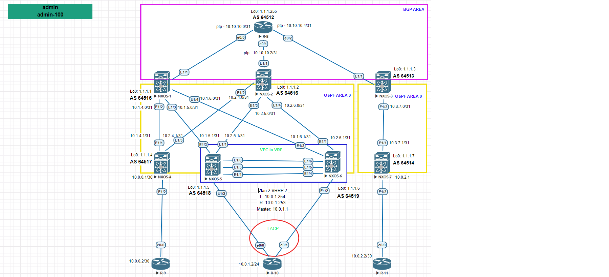

Цель: Настроить BGP для Underlay сети

1. Настроить BGP в Underlay сети, для IP связанности между всеми устройствами NXOS

1. Настроить BGP в Underlay сети, для IP связанности между всеми устройствами NXOS.
2. Проверка связности месжду сетями расположенных в одной локации, так и между локациями.
3. Предоставить вывод таблиц маршрутизации с утройств.

Пояснение. На схеме отражена распределенная сеть построенная на базе протокола OSPF. Все маршрутизаторы находятся в единой Area 0. Связь между сетями происходит через единый маршрутизатор R-8.
Сеть имеет ряд недостатков:

1. Единая точка отказа. Маршрутизацтор R-8.
2. Отсутствие резервных линий связи от устройств NXOS 4-6 к R-8.
3. Не оптимальная настройки протокала OSPF.
4. Для подключения маршрутизатора R-10 используется протокол VRRP.

! В выводе убраны все настройки не относящиеся к поставленной задаче.

Настройка маршрутизатора R-8:

R-8

<pre><code>

interface Loopback0
 ip address 1.1.1.255 255.255.255.255
!
interface Ethernet0/0
 ip address 10.10.10.0 255.255.255.254
!
interface Ethernet0/1
 ip address 10.10.10.2 255.255.255.254
!
interface Ethernet0/2
 ip address 10.10.10.4 255.255.255.254
!
interface Ethernet0/3
 no ip address
!
router bgp 64512
 bgp router-id 1.1.1.255
 bgp log-neighbor-changes
 network 1.1.1.255 mask 255.255.255.255
 neighbor 10.10.10.1 remote-as 64515
 neighbor 10.10.10.1 soft-reconfiguration inbound
 neighbor 10.10.10.3 remote-as 64516
 neighbor 10.10.10.3 soft-reconfiguration inbound
 neighbor 10.10.10.5 remote-as 64513
 neighbor 10.10.10.5 soft-reconfiguration inbound

</code></pre>

