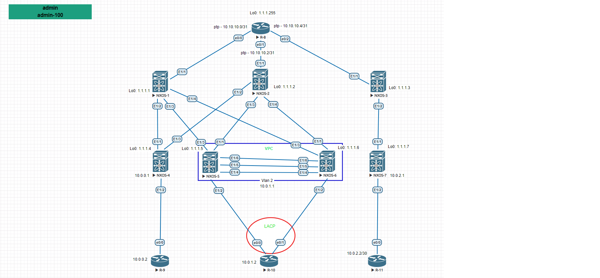

Цель: Настроить OSPF для Underlay сети.

1. Настроить OSPF в Underlay сети, для IP связанности между всеми устройствами NXOS.
2. Проверка связности месжду сетями расположенных в одной локации, так и между локациями.
3. Предоставить вывод таблиц маршрутизации с утройств.

Пояснение. На схеме отражена распределенная сеть построенная на базе протокола OSPF. Все маршрутизаторы находятся в единой Area 0. Связь между сетями происходит через единый маршрутизатор R-8.
Сеть имеет ряд недостатков:

1. Единая точка отказа. Маршрутизацтор R-8.
2. Отсутствие резервных линий связи от устройств NXOS 4-6 к R-8.
3. Не оптимальная настройки протокала OSPF.
4. Для подключения маршрутизатора R-10 используется протокол VRRP.

! В выводе убраны все настройки не относящиеся к поставленной задаче.

Настройка маршрутизатора R-8:

R-8

<pre><code>

interface Loopback0
 ip address 1.1.1.255 255.255.255.255
!
interface Ethernet0/0
 ip address 10.10.10.0 255.255.255.254
!
interface Ethernet0/1
 ip address 10.10.10.2 255.255.255.254
!
interface Ethernet0/2
 ip address 10.10.10.4 255.255.255.254
!
interface Ethernet0/3
 no ip address
!
router ospf 1
 router-id 1.1.1.255
 passive-interface default
 no passive-interface Ethernet0/0
 no passive-interface Ethernet0/1
 no passive-interface Ethernet0/2
 network 1.1.1.255 0.0.0.0 area 0
 network 10.10.10.0 0.0.0.1 area 0
 network 10.10.10.2 0.0.0.1 area 0
 network 10.10.10.4 0.0.0.1 area 0

</code></pre>

Настройка SPINE коммутаторов:

NXOS-1

<pre><code>
SPINE-1# show run

feature ospf
feature interface-vlan
feature hsrp
feature lacp
feature vpc

interface Ethernet1/1
  no switchport
  ip address 10.10.10.1/31
  ip router ospf UNDERLAY area 0.0.0.0
  no shutdown

interface Ethernet1/2
  no switchport
  medium p2p
  ip unnumbered loopback0
  ip router ospf UNDERLAY area 0.0.0.0
  no shutdown

interface Ethernet1/3
  no switchport
  medium p2p
  ip unnumbered loopback0
  ip router ospf UNDERLAY area 0.0.0.0
  no shutdown

interface Ethernet1/4
  no switchport
  medium p2p
  ip unnumbered loopback0
  ip router ospf UNDERLAY area 0.0.0.0
  no shutdown

interface loopback0
  ip address 1.1.1.1/32
  ip router ospf UNDERLAY area 0.0.0.0
cli alias name wr copy running-config startup-config
line console
line vty
boot nxos bootflash:/nxos.9.2.2.bin
router ospf UNDERLAY
  router-id 1.1.1.1
  log-adjacency-changes detail

</code></pre>

NXOS-2

<pre><code>
SPINE-2# show run
feature ospf
feature interface-vlan
feature hsrp
feature lacp
feature vpc

interface Ethernet1/1
  no switchport
  ip address 10.10.10.3/31
  ip router ospf UNDERLAY area 0.0.0.0
  no shutdown

interface Ethernet1/2
  no switchport
  medium p2p
  ip unnumbered loopback0
  ip router ospf UNDERLAY area 0.0.0.0
  no shutdown

interface Ethernet1/3
  no switchport
  medium p2p
  ip unnumbered loopback0
  ip router ospf UNDERLAY area 0.0.0.0
  no shutdown

interface Ethernet1/4
  no switchport
  medium p2p
  ip unnumbered loopback0
  ip router ospf UNDERLAY area 0.0.0.0
  no shutdown

interface loopback0
  ip address 1.1.1.2/32
  ip router ospf UNDERLAY area 0.0.0.0
cli alias name wr copy running-config startup-config
line console
line vty
boot nxos bootflash:/nxos.9.2.2.bin
router ospf UNDERLAY
  router-id 1.1.1.2
  log-adjacency-changes detail

</code></pre>

NXOS-3

<pre><code>

SPINE-3# show run
feature ospf
feature interface-vlan
feature hsrp
feature lacp
feature vpc

interface Ethernet1/1
  no switchport
  ip address 10.10.10.5/31
  ip router ospf UNDERLAY area 0.0.0.0
  no shutdown

interface Ethernet1/2
  no switchport
  medium p2p
  ip unnumbered loopback0
  ip router ospf UNDERLAY area 0.0.0.0
  no shutdown

interface loopback0
  ip address 1.1.1.3/32
  ip router ospf UNDERLAY area 0.0.0.0
cli alias name wr copy running-config startup-config
line console
line vty
boot nxos bootflash:/nxos.9.2.2.bin
router ospf UNDERLAY
  router-id 1.1.1.3
  log-adjacency-changes detail

</code></pre>

Настройка LEAF коммутаторов:

NXOS-4

<pre><code>

feature ospf
feature interface-vlan
feature hsrp
feature lacp
feature vpc

ip prefix-list redistribute_list seq 5 permit 10.0.0.0/30
route-map OSPF-redistribute permit 10
  match ip address prefix-list redistribute_list

interface Ethernet1/1
  no switchport
  medium p2p
  ip unnumbered loopback0
  ip router ospf UNDERLAY area 0.0.0.0
  no shutdown

interface Ethernet1/2
  no switchport
  ip address 10.0.0.1/30
  no shutdown

interface Ethernet1/3
  no switchport
  medium p2p
  ip unnumbered loopback0
  ip router ospf UNDERLAY area 0.0.0.0
  no shutdown

  interface loopback0
  ip address 1.1.1.4/32
  ip router ospf UNDERLAY area 0.0.0.0
cli alias name wr copy running-config startup-config
line console
line vty
boot nxos bootflash:/nxos.9.2.2.bin
router ospf UNDERLAY
  router-id 1.1.1.4
  redistribute direct route-map OSPF-redistribute
  log-adjacency-changes detail

</code></pre>

NXOS-5

<pre><code>

feature vrrp
cfs eth distribute
feature ospf
feature interface-vlan
feature hsrp
feature lacp
feature vpc

vlan 1-2
vlan 2
  name Client-Vlan2

ip prefix-list redistribute_list seq 5 permit 10.0.1.0/24
route-map OSPF-redistribute permit 10
  match ip address prefix-list redistribute_list
vrf context VPC
vrf context management
vpc domain 1
  role priority 100
  peer-keepalive destination 10.200.100.2 source 10.200.100.1 vrf VPC

interface Vlan1

interface Vlan2
  no shutdown
  ip address 10.0.1.254/24
  vrrp 2
    priority 1
    address 10.0.1.1
    no shutdown

interface port-channel1
  description *** VPC PEERLINK ***
  switchport mode trunk
  spanning-tree port type network
  vpc peer-link

interface port-channel2
  switchport access vlan 2
  vpc 1

interface Ethernet1/1
  no switchport
  medium p2p
  ip unnumbered loopback0
  ip router ospf UNDERLAY area 0.0.0.0
  no shutdown

interface Ethernet1/2
  switchport access vlan 2
  channel-group 2 mode active

interface Ethernet1/3
  no switchport
  medium p2p
  ip unnumbered loopback0
  ip router ospf UNDERLAY area 0.0.0.0
  no shutdown

interface Ethernet1/4
  description *** VPC KEEPALIVE LINK ***
  no switchport
  vrf member VPC
  ip address 10.200.100.1/24
  no shutdown

interface Ethernet1/5
  switchport mode trunk
  channel-group 1 mode active

interface Ethernet1/6
  switchport mode trunk
  channel-group 1 mode active

interface loopback0
  ip address 1.1.1.5/32
  ip router ospf UNDERLAY area 0.0.0.0
cli alias name wr copy running-config startup-config
line console
line vty
boot nxos bootflash:/nxos.9.2.2.bin
router ospf UNDERLAY
  router-id 1.1.1.5
  redistribute direct route-map OSPF-redistribute
  log-adjacency-changes detail

</code></pre>

NXOS-6

<pre><code>

feature vrrp
cfs eth distribute
feature ospf
feature interface-vlan
feature hsrp
feature lacp
feature vpc

vlan 1-2
vlan 2
  name Client-Vlan2

ip prefix-list redistribute_list seq 5 permit 10.0.1.0/24
route-map OSPF-redistribute permit 10
  match ip address prefix-list redistribute_list
vrf context VPC
vrf context management
vpc domain 1
  role priority 1
  peer-keepalive destination 10.200.100.1 source 10.200.100.2 vrf VPC

interface Vlan1

interface Vlan2
  no shutdown
  ip address 10.0.1.253/24
  vrrp 2
    priority 2
    address 10.0.1.1
    no shutdown

interface port-channel1
  description *** VPC PEERLINK ***
  switchport mode trunk
  spanning-tree port type network
  vpc peer-link

interface port-channel2
  switchport access vlan 2
  vpc 1

interface Ethernet1/1
  no switchport
  medium p2p
  ip unnumbered loopback0
  ip router ospf UNDERLAY area 0.0.0.0
  no shutdown

interface Ethernet1/2
  switchport access vlan 2
  channel-group 2 mode active

interface Ethernet1/3
  no switchport
  medium p2p
  ip unnumbered loopback0
  ip router ospf UNDERLAY area 0.0.0.0
  no shutdown

interface Ethernet1/4
  description *** VPC KEEPALIVE LINK ***
  no switchport
  vrf member VPC
  ip address 10.200.100.2/24
  no shutdown

interface Ethernet1/5
  switchport mode trunk
  channel-group 1 mode active

interface Ethernet1/6
  switchport mode trunk
  channel-group 1 mode active

interface loopback0
  ip address 1.1.1.6/32
  ip router ospf UNDERLAY area 0.0.0.0
cli alias name wr copy running-config startup-config
line console
line vty
boot nxos bootflash:/nxos.9.2.2.bin
router ospf UNDERLAY
  router-id 1.1.1.6
  redistribute direct route-map OSPF-redistribute
  log-adjacency-changes detail

</code></pre>

NXOS-7

<pre><code>

cfs eth distribute
feature ospf
feature interface-vlan
feature hsrp
feature lacp
feature vpc

vlan 1

ip prefix-list redistribute_list seq 5 permit 10.0.2.0/30
route-map OSPF-redistribute permit 10
  match ip address prefix-list redistribute_list

interface Ethernet1/1
  no switchport
  medium p2p
  ip unnumbered loopback0
  ip router ospf UNDERLAY area 0.0.0.0
  no shutdown

interface Ethernet1/2
  no switchport
  ip address 10.0.2.1/30
  no shutdown

interface loopback0
  ip address 1.1.1.7/32
  ip router ospf UNDERLAY area 0.0.0.0
cli alias name wr copy running-config startup-config
line console
line vty
boot nxos bootflash:/nxos.9.2.2.bin
router ospf UNDERLAY
  router-id 1.1.1.7
  redistribute direct route-map OSPF-redistribute
  log-adjacency-changes detail

</code></pre>

Настройка клиентских устройств:

R-9

<pre><code>

interface Ethernet0/0
 ip address 10.0.0.2 255.255.255.252

ip route 0.0.0.0 0.0.0.0 10.0.0.1

</code></pre>

R-11

<pre><code>

interface Ethernet0/0
 ip address 10.0.2.2 255.255.255.252

ip route 0.0.0.0 0.0.0.0 10.0.2.1

</code></pre>

R-10

<pre><code>

interface Port-channel1
 switchport access vlan 2
 switchport mode access
!
interface Ethernet0/0
 switchport access vlan 2
 switchport mode access
 channel-group 1 mode active
!
interface Ethernet0/1
 switchport access vlan 2
 switchport mode access
 channel-group 1 mode active

interface Vlan2
 ip address 10.0.1.2 255.255.255.0

ip route 0.0.0.0 0.0.0.0 10.0.1.1

</code></pre>

Статус VPC и VVRP c NXOS-5

VPC

<pre><code>

(*) - local vPC is down, forwarding via vPC peer-link

vPC domain id                     : 1
Peer status                       : peer adjacency formed ok
vPC keep-alive status             : peer is alive
Configuration consistency status  : success
Per-vlan consistency status       : success
Type-2 consistency status         : success
vPC role                          : secondary
Number of vPCs configured         : 1
Peer Gateway                      : Disabled
Dual-active excluded VLANs        : -
Graceful Consistency Check        : Enabled
Auto-recovery status              : Disabled
Delay-restore status              : Timer is off.(timeout = 30s)
Delay-restore SVI status          : Timer is off.(timeout = 10s)
Operational Layer3 Peer-router    : Disabled

vPC Peer-link status
---------------------------------------------------------------------
id    Port   Status Active vlans
--    ----   ------ -------------------------------------------------
1     Po1    up     1-2

vPC status
----------------------------------------------------------------------------
Id    Port          Status Consistency Reason                Active vlans
--    ------------  ------ ----------- ------                ---------------
1     Po2           up     success     success               2

</code></pre>

VRRP

<pre><code>
Vlan2 - Group 2 (IPV4)
     State is Backup
     Virtual IP address is 10.0.1.1
     Priority 1, Configured 1
     Forwarding threshold(for VPC), lower: 1 upper: 1
     Advertisement interval 1
     Preemption enabled
     Virtual MAC address is 0000.5e00.0102
     Master router is 10.0.1.253

</code></pre>

Проверка с R-8:

show ip ospf neighbor

<pre><code>

Neighbor ID     Pri   State           Dead Time   Address         Interface
1.1.1.3           1   FULL/BDR        00:00:32    10.10.10.5      Ethernet0/2
1.1.1.2           1   FULL/BDR        00:00:35    10.10.10.3      Ethernet0/1
1.1.1.1           1   FULL/BDR        00:00:36    10.10.10.1      Ethernet0/0

</code></pre>

show ip route ospf

<pre><code>
1.0.0.0/32 is subnetted, 8 subnets
O        1.1.1.1 [110/11] via 10.10.10.1, 00:26:41, Ethernet0/0
O        1.1.1.2 [110/11] via 10.10.10.3, 00:27:13, Ethernet0/1
O        1.1.1.3 [110/11] via 10.10.10.5, 00:26:52, Ethernet0/2
O        1.1.1.4 [110/51] via 10.10.10.3, 00:18:08, Ethernet0/1
           [110/51] via 10.10.10.1, 00:17:58, Ethernet0/0
O        1.1.1.5 [110/51] via 10.10.10.3, 00:27:02, Ethernet0/1
           [110/51] via 10.10.10.1, 00:26:31, Ethernet0/0
O        1.1.1.6 [110/51] via 10.10.10.3, 00:27:02, Ethernet0/1
           [110/51] via 10.10.10.1, 00:26:41, Ethernet0/0
O        1.1.1.7 [110/51] via 10.10.10.5, 00:26:52, Ethernet0/2
10.0.0.0/8 is variably subnetted, 9 subnets, 4 masks
O E2     10.0.0.0/30 [110/20] via 10.10.10.3, 00:18:08, Ethernet0/1
               [110/20] via 10.10.10.1, 00:17:58, Ethernet0/0
O E2     10.0.1.0/24 [110/20] via 10.10.10.3, 00:27:02, Ethernet0/1
               [110/20] via 10.10.10.1, 00:26:41, Ethernet0/0
O E2     10.0.2.0/30 [110/20] via 10.10.10.5, 00:26:52, Ethernet0/2

</code></pre>

Доступность клиентов по ICMP

<pre><code>
ping 10.0.0.2 re 100
Type escape sequence to abort.
Sending 100, 100-byte ICMP Echos to 10.0.0.2, timeout is 2 seconds:
!!!!!!!!!!!!!!!!!!!!!!!!!!!!!!!!!!!!!!!!!!!!!!!!!!!!!!!!!!!!!!!!!!!!!!
!!!!!!!!!!!!!!!!!!!!!!!!!!!!!!
Success rate is 100 percent (100/100), round-trip min/avg/max = 6/12/28 ms

ping 10.0.1.2 re 100
Type escape sequence to abort.
Sending 100, 100-byte ICMP Echos to 10.0.1.2, timeout is 2 seconds:
!!!!!!!!!!!!!!!!!!!!!!!!!!!!!!!!!!!!!!!!!!!!!!!!!!!!!!!!!!!!!!!!!!!!!!
!!!!!!!!!!!!!!!!.!!!!!!!!!!!!!!
Success rate is 100 percent (100/100), round-trip min/avg/max = 16/21/44 ms

ping 10.0.2.2 re 100
Type escape sequence to abort.
Sending 100, 100-byte ICMP Echos to 10.0.2.2, timeout is 2 seconds:
!!!!!!!!!!!!!!!!!!!!!!!!!!!!!!!!!!!!!!!!!!!!!!!!!!!!!!!!!!!!!!!!!!!!!!
!!!!!!!!!!!!!!!!!!!!!!!!!!!!!!

</code></pre>

