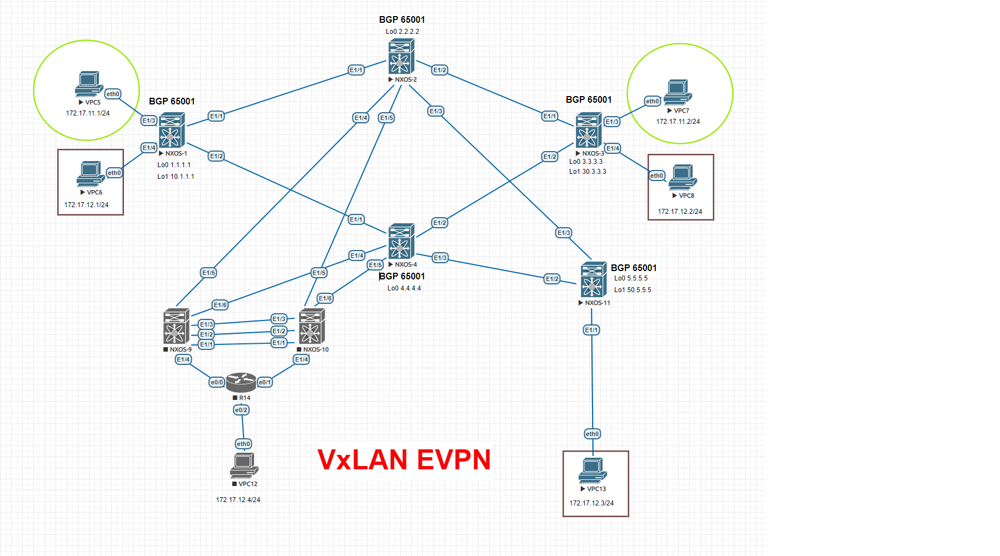

Цель:
Настроить Overlay на основе VxLAN EVPN для L2 связанности между клиентами

В этой  самостоятельной работе мы ожидаем, что вы самостоятельно:

1. Настроить BGP peering между Leaf и Spine в AF l2vpn evpn
2. Spine работает в качестве route-reflector
3. Настроена связанность между клиентами в первой зоне

! В выводе убраны все настройки не относящиеся к поставленной задаче.

Настройка BGP RR NSOS-2 и NXOS-4:

NSOS-2

<pre><code>
NX-2# show run

nv overlay evpn
feature ospf
feature bgp
feature interface-vlan
feature vn-segment-vlan-based
feature nv overlay

interface Ethernet1/1
  no switchport
  medium p2p
  ip unnumbered loopback0
  ip ospf network point-to-point
  no ip ospf passive-interface
  ip router ospf UNDER area 0.0.0.0
  no shutdown

interface Ethernet1/2
  no switchport
  medium p2p
  ip unnumbered loopback0
  ip ospf network point-to-point
  no ip ospf passive-interface
  ip router ospf UNDER area 0.0.0.0
  no shutdown

interface Ethernet1/3
  no switchport
  medium p2p
  ip unnumbered loopback0
  ip ospf network point-to-point
  no ip ospf passive-interface
  ip router ospf UNDER area 0.0.0.0
  no shutdown

interface loopback0
  ip address 2.2.2.2/32
  ip router ospf UNDER area 0.0.0.0
cli alias name wr copy running-config startup-config
line console
line vty
boot nxos bootflash:/nxos.9.2.2.bin
router ospf UNDER
  router-id 2.2.2.2
router bgp 65001
  template peer LEAF
    remote-as 65001
    update-source loopback0
    address-family l2vpn evpn
      send-community
      send-community extended
      route-reflector-client
  neighbor 1.1.1.1
    inherit peer LEAF
  neighbor 3.3.3.3
    inherit peer LEAF
  neighbor 5.5.5.5
    inherit peer LEAF

</code></pre>

NSOS-4

<pre><code>
NX-4# show run

nv overlay evpn
feature ospf
feature bgp
feature interface-vlan
feature vn-segment-vlan-based
feature nv overlay

interface Ethernet1/1
  no switchport
  medium p2p
  ip unnumbered loopback0
  ip ospf network point-to-point
  no ip ospf passive-interface
  ip router ospf UNDER area 0.0.0.0
  no shutdown

interface Ethernet1/2
  no switchport
  medium p2p
  ip unnumbered loopback0
  ip ospf network point-to-point
  no ip ospf passive-interface
  ip router ospf UNDER area 0.0.0.0
  no shutdown

interface Ethernet1/3
  no switchport
  medium p2p
  ip unnumbered loopback0
  ip ospf network point-to-point
  no ip ospf passive-interface
  ip router ospf UNDER area 0.0.0.0
  no shutdown

interface loopback0
  ip address 4.4.4.4/32
  ip router ospf UNDER area 0.0.0.0
cli alias name wr copy running-config startup-config
line console
line vty
boot nxos bootflash:/nxos.9.2.2.bin
router ospf UNDER
  router-id 4.4.4.4
router bgp 65001
  template peer LEAF
    remote-as 65001
    update-source loopback0
    address-family l2vpn evpn
      send-community
      send-community extended
      route-reflector-client
  neighbor 1.1.1.1
    inherit peer LEAF
  neighbor 3.3.3.3
    inherit peer LEAF
  neighbor 5.5.5.5
    inherit peer LEAF

</code></pre>

Настройка Leaf NSOS-1 NXOS-3 и NXOS-11:

NSOS-1

<pre><code>
NX-1# show run

nv overlay evpn
feature ospf
feature bgp
feature interface-vlan
feature vn-segment-vlan-based
feature nv overlay

vlan 1,11-12
vlan 11
  vn-segment 11000
vlan 12
  vn-segment 12000

interface nve1
  no shutdown
  host-reachability protocol bgp
  source-interface loopback1
  member vni 11000
    ingress-replication protocol bgp
  member vni 12000
    ingress-replication protocol bgp

interface Ethernet1/1
  no switchport
  medium p2p
  ip unnumbered loopback0
  ip ospf network point-to-point
  no ip ospf passive-interface
  ip router ospf UNDER area 0.0.0.0
  no shutdown

interface Ethernet1/2
  no switchport
  medium p2p
  ip unnumbered loopback0
  ip ospf network point-to-point
  no ip ospf passive-interface
  ip router ospf UNDER area 0.0.0.0
  no shutdown

interface Ethernet1/3
  switchport access vlan 11

interface Ethernet1/4
  switchport access vlan 12

interface loopback0
  ip address 1.1.1.1/32
  ip router ospf UNDER area 0.0.0.0

interface loopback1
  ip address 10.1.1.1/32
  ip router ospf UNDER area 0.0.0.0
cli alias name wr copy running-config startup-config
line console
line vty
no feature signature-verification
router ospf UNDER
  router-id 1.1.1.1
router bgp 65001
  template peer SPINE
    remote-as 65001
    update-source loopback0
    address-family l2vpn evpn
      send-community
      send-community extended
  neighbor 2.2.2.2
    inherit peer SPINE
  neighbor 4.4.4.4
    inherit peer SPINE

</code></pre>

NSOS-3

<pre><code>
NX-3# show run

nv overlay evpn
feature ospf
feature bgp
feature interface-vlan
feature vn-segment-vlan-based
feature nv overlay

interface nve1
  no shutdown
  host-reachability protocol bgp
  source-interface loopback1
  member vni 11000
    ingress-replication protocol bgp
  member vni 12000
    ingress-replication protocol bgp

interface Ethernet1/1
  no switchport
  medium p2p
  ip unnumbered loopback0
  ip ospf network point-to-point
  no ip ospf passive-interface
  ip router ospf UNDER area 0.0.0.0
  no shutdown

interface Ethernet1/2
  no switchport
  medium p2p
  ip unnumbered loopback0
  ip ospf network point-to-point
  no ip ospf passive-interface
  ip router ospf UNDER area 0.0.0.0
  no shutdown

interface Ethernet1/3
  switchport access vlan 11

interface Ethernet1/4
  switchport access vlan 12

interface loopback0
  ip address 3.3.3.3/32
  ip router ospf UNDER area 0.0.0.0

interface loopback1
  ip address 30.3.3.3/32
  ip router ospf UNDER area 0.0.0.0
cli alias name wr copy running-config startup-config
line console
line vty
no feature signature-verification
router ospf UNDER
  router-id 3.3.3.3
router bgp 65001
  template peer SPINE
    remote-as 65001
    update-source loopback0
    address-family l2vpn evpn
      send-community
      send-community extended
  neighbor 2.2.2.2
    inherit peer SPINE
  neighbor 4.4.4.4
    inherit peer SPINE

</code></pre>

NSOS-11

<pre><code>
NX-11# show run

nv overlay evpn
feature ospf
feature bgp
feature interface-vlan
feature vn-segment-vlan-based
feature nv overlay

vlan 1,12
vlan 12
  vn-segment 12000

interface nve1
  no shutdown
  host-reachability protocol bgp
  source-interface loopback1
  member vni 12000
    ingress-replication protocol bgp

interface Ethernet1/1
  switchport access vlan 12

interface Ethernet1/2
  no switchport
  medium p2p
  ip unnumbered loopback0
  ip ospf network point-to-point
  no ip ospf passive-interface
  ip router ospf UNDER area 0.0.0.0
  no shutdown

interface Ethernet1/3
  no switchport
  medium p2p
  ip unnumbered loopback0
  ip ospf network point-to-point
  no ip ospf passive-interface
  ip router ospf UNDER area 0.0.0.0
  no shutdown

interface loopback0
  ip address 5.5.5.5/32
  ip router ospf UNDER area 0.0.0.0

interface loopback1
  ip address 50.5.5.5/32
  ip router ospf UNDER area 0.0.0.0
cli alias name wr copy running-config startup-config
line console
line vty
no feature signature-verification
router ospf UNDER
  router-id 5.5.5.5
router bgp 65001
  template peer SPINE
    remote-as 65001
    update-source loopback0
    address-family l2vpn evpn
      send-community
      send-community extended
  neighbor 2.2.2.2
    inherit peer SPINE
  neighbor 4.4.4.4
    inherit peer SPINE

</code></pre>

Статус Leaf NSOS-1 NXOS-3 и NXOS-11:

R-1

<pre><code>

</code></pre>

R-3

<pre><code>

</code></pre>

R-11

<pre><code>
NX-11# show nve internal platform interface nve 1 detail
Printing Interface ifindex 0x49000001 detail
|======|=========================|===============|===============|=====|=====|
|Intf  |State                    |PriIP          |SecIP          |Vnis |Peers|
|======|=========================|===============|===============|=====|=====|
|nve1  |UP                       |50.5.5.5       |0.0.0.0        |1    |2    |
|======|=========================|===============|===============|=====|=====|

SW_BD/VNIs of interface nve1:
================================================
|======|======|=========================|======|====|======|========
|Sw BD |Vni   |State                    |Intf  |Type|Vrf-ID|Notified
|======|======|=========================|======|====|======|========
|12    |12000 |UP                       |nve1  |CP  |0     |Yes
|======|======|=========================|======|====|======|========

Peers of interface nve1:
============================================

Peer_ip: 10.1.1.1
  Peer-ID   : 1
  State     : UP
  Learning  : Disabled
  TunnelID  : 0x0
  Mode      : Symmetric
  MAC       : 0000.0000.0000
  Table-ID  : 0x1
  Encap     : 0x0

Peer_ip: 30.3.3.3
  Peer-ID   : 2
  State     : UP
  Learning  : Disabled
  TunnelID  : 0x0
  Mode      : Symmetric
  MAC       : 0000.0000.0000
  Table-ID  : 0x1
  Encap     : 0x0

  NX-11# show bgp l2vpn evpn summary

  Neighbor        V    AS MsgRcvd MsgSent   TblVer  InQ OutQ Up/Down  State/PfxRcd
  - 2.2.2.2         4 65001      88      97       29    0    0 01:14:19 2
  - 4.4.4.4         4 65001      87      96       29    0    0 01:13:16 2

  NX-11# show bgp l2vpn evpn

     Network            Next Hop            Metric     LocPrf     Weight Path
  Route Distinguisher: 1.1.1.1:32779
  *>i[2]:[0]:[0]:[48]:[0050.7966.6806]:[0]:[0.0.0.0]/216
                        10.1.1.1                          100          0 i
  * i                   10.1.1.1                          100          0 i
  * i[3]:[0]:[32]:[10.1.1.1]/88
                        10.1.1.1                          100          0 i
  *>i                   10.1.1.1                          100          0 i

  Route Distinguisher: 3.3.3.3:32779
  *>i[2]:[0]:[0]:[48]:[0050.7966.6808]:[0]:[0.0.0.0]/216
                        30.3.3.3                          100          0 i
  * i                   30.3.3.3                          100          0 i
  * i[3]:[0]:[32]:[30.3.3.3]/88
                        30.3.3.3                          100          0 i
  *>i                   30.3.3.3                          100          0 i

  Route Distinguisher: 5.5.5.5:32779    (L2VNI 12000)
  *>i[2]:[0]:[0]:[48]:[0050.7966.6806]:[0]:[0.0.0.0]/216
                        10.1.1.1                          100          0 i
  *>i[2]:[0]:[0]:[48]:[0050.7966.6808]:[0]:[0.0.0.0]/216
                        30.3.3.3                          100          0 i
  *>l[2]:[0]:[0]:[48]:[0050.7966.680d]:[0]:[0.0.0.0]/216
                        50.5.5.5                          100      32768 i
  *>i[3]:[0]:[32]:[10.1.1.1]/88
                        10.1.1.1                          100          0 i
  *>i[3]:[0]:[32]:[30.3.3.3]/88
                        30.3.3.3                          100          0 i
  *>l[3]:[0]:[32]:[50.5.5.5]/88
                        50.5.5.5                          100      32768 i

</code></pre>

