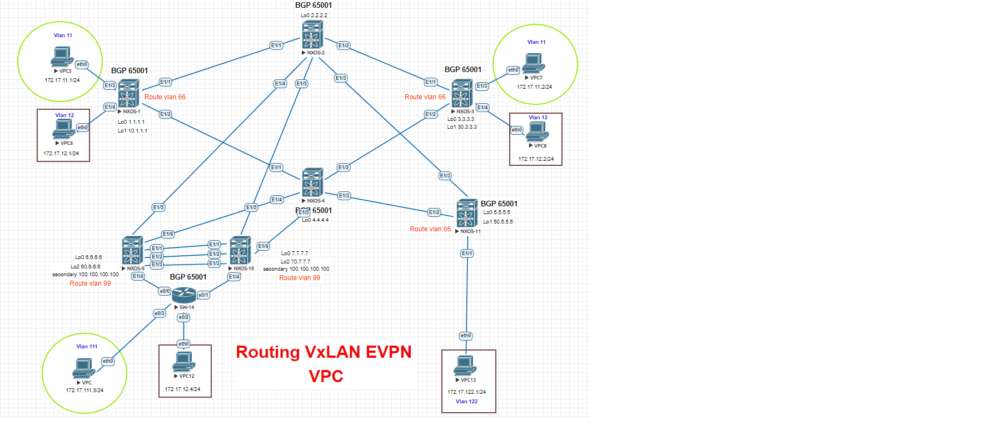
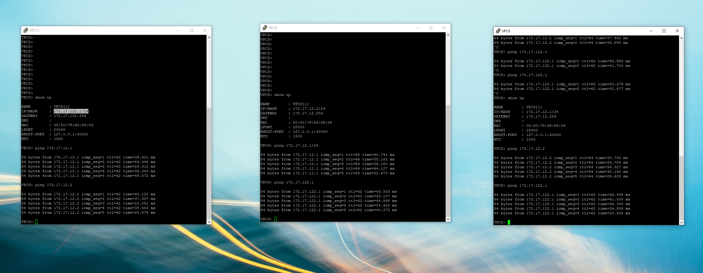

Цель: Настроить Overlay на основе с использованием VPC;
      Маршрутизация в Overlay.

1. Организована связность между сетями 172.17.12.0/24 и 172.17.122.0/24 расположенными между разными LEAF коммутаторами. Локальный vlan-id 12 и 122.
2. Схема подключения к SPINE осталась без изменения, ее показывать не буду.
3. Для маршрутизации трафика внутри L3VNI используется
- vlan 66 на NX-1, NX-3, NX-11.
- vlan 99 на NX-9 и NX-10.

! В выводе убраны все настройки не относящиеся к поставленной задаче.

NX-1

<pre><code>
vlan 1,11-12,66,99
vlan 11
  vn-segment 11000
vlan 12
  vn-segment 12000
vlan 66
  name For-VXLAN-Routing
  vn-segment 6666

vrf context Vlan12-VRF
  vni 6666
  address-family ipv4 unicast
    route-target import 6666:6666
    route-target import 6666:6666 evpn
    route-target export 6666:6666
    route-target export 6666:6666 evpn
    route-target both auto
    route-target both auto evpn
vrf context management

interface Vlan1

interface Vlan11
  no shutdown
  ip address 172.17.11.254/24
  fabric forwarding mode anycast-gateway

interface Vlan12
  no shutdown
  vrf member Vlan12-VRF
  ip address 172.17.12.254/24
  fabric forwarding mode anycast-gateway

interface Vlan66
  no shutdown
  vrf member Vlan12-VRF
  ip forward

interface nve1
  no shutdown
  host-reachability protocol bgp
  source-interface loopback1
  member vni 6666 associate-vrf
  member vni 11000
    ingress-replication protocol bgp
  member vni 12000
    ingress-replication protocol bgp

</code></pre>

NX-3

<pre><code>
vlan 1,11-12,66
vlan 11
  vn-segment 11000
vlan 12
  vn-segment 12000
vlan 66
  name For-VXLAN-Routing
  vn-segment 6666

vrf context Vlan12-VRF
  vni 6666
  address-family ipv4 unicast
    route-target import 6666:6666
    route-target import 6666:6666 evpn
    route-target export 6666:6666
    route-target export 6666:6666 evpn
    route-target both auto
    route-target both auto evpn

interface Vlan11
  no shutdown
  ip address 172.17.11.254/24
  fabric forwarding mode anycast-gateway

interface Vlan12
  no shutdown
  vrf member Vlan12-VRF
  ip address 172.17.12.254/24
  fabric forwarding mode anycast-gateway

interface Vlan66
  no shutdown
  vrf member Vlan12-VRF
  ip forward

interface nve1
  no shutdown
  host-reachability protocol bgp
  source-interface loopback1
  member vni 6666 associate-vrf
  member vni 11000
    ingress-replication protocol bgp
  member vni 12000
    ingress-replication protocol bgp

</code></pre>

NX-11

<pre><code>
vlan 1,66,122
vlan 66
  name For-VXLAN-Routing
  vn-segment 6666
vlan 122
  vn-segment 12000

vrf context Vlan12-VRF
  vni 6666
  address-family ipv4 unicast
    route-target import 6666:6666
    route-target import 6666:6666 evpn
    route-target export 6666:6666
    route-target export 6666:6666 evpn
    route-target both auto
    route-target both auto evpn

interface Vlan66
  no shutdown
  vrf member Vlan12-VRF
  ip forward

interface Vlan122
  no shutdown
  vrf member Vlan12-VRF
  ip address 172.17.122.254/24
  fabric forwarding mode anycast-gateway

interface nve1
  no shutdown
  host-reachability protocol bgp
  source-interface loopback1
  member vni 6666 associate-vrf
  member vni 12000
    ingress-replication protocol bgp

interface Ethernet1/1
  switchport access vlan 122

</code></pre>

NX-9

<pre><code>

vlan 12
  vn-segment 12000
vlan 99
  name For-VXLAN-Routing
  vn-segment 6666

vrf context VPC
vrf context Vlan12-VRF
  vni 6666
  address-family ipv4 unicast
    route-target import 6666:6666
    route-target import 6666:6666 evpn
    route-target export 6666:6666
    route-target export 6666:6666 evpn
    route-target both auto
    route-target both auto evpn

interface Vlan12
  no shutdown
  vrf member Vlan12-VRF
  ip address 172.17.12.254/24
  fabric forwarding mode anycast-gateway
interface Vlan99
  no shutdown
  vrf member Vlan12-VRF
  ip forward

interface nve1
  no shutdown
  host-reachability protocol bgp
  source-interface loopback1
  member vni 6666 associate-vrf
  member vni 11000
    ingress-replication protocol bgp
  member vni 12000
    ingress-replication protocol bgp

</code></pre>

NX-10

<pre><code>
vlan 12
  vn-segment 12000
vlan 99
  name For-VXLAN-Routing
  vn-segment 6666

vrf context VPC
vrf context Vlan12-VRF
  vni 6666
  address-family ipv4 unicast
    route-target import 6666:6666
    route-target import 6666:6666 evpn
    route-target export 6666:6666
    route-target export 6666:6666 evpn
    route-target both auto
    route-target both auto evpn
vrf context management

interface Vlan11
  no shutdown
  ip address 172.17.11.254/24
  fabric forwarding mode anycast-gateway

interface Vlan12
  no shutdown
  vrf member Vlan12-VRF
  ip address 172.17.12.254/24
  fabric forwarding mode anycast-gateway

interface Vlan99
  no shutdown
  vrf member Vlan12-VRF
  ip forward

interface nve1
  no shutdown
  host-reachability protocol bgp
  source-interface loopback1
  member vni 6666 associate-vrf
  member vni 11000
    ingress-replication protocol bgp
  member vni 12000
    ingress-replication protocol bgp
</code></pre>

! Проверка доступности маршрутизации внутри VNI

Иаршрутная информация

NX-11

<pre><code>
 show ip ro vrf Vlan12-VRF
172.17.12.1/32, ubest/mbest: 1/0
    *via 10.1.1.1%default, [200/0], 00:58:21, bgp-65001, internal, tag 65001 (evpn) segid: 6666 tunnelid: 0xa010101 encap: VXLAN

172.17.12.2/32, ubest/mbest: 1/0
    *via 30.3.3.3%default, [200/0], 17:32:14, bgp-65001, internal, tag 65001 (evpn) segid: 6666 tunnelid: 0x1e030303 encap: VXLAN

172.17.12.4/32, ubest/mbest: 1/0
    *via 100.100.100.100%default, [200/0], 00:39:13, bgp-65001, internal, tag 65001 (evpn) segid: 6666 tunnelid: 0x64646464 encap: VXLAN

172.17.122.0/24, ubest/mbest: 1/0, attached
    *via 172.17.122.254, Vlan122, [0/0], 17:49:07, direct
172.17.122.1/32, ubest/mbest: 1/0, attached
    *via 172.17.122.1, Vlan122, [190/0], 17:31:59, hmm
172.17.122.254/32, ubest/mbest: 1/0, attached
    *via 172.17.122.254, Vlan122, [0/0], 17:49:07, local

</code></pre>

NX-3

<pre><code>
 show ip ro vrf Vlan12-VRF
 172.17.12.0/24, ubest/mbest: 1/0, attached
    *via 172.17.12.254, Vlan12, [0/0], 18:09:06, direct
172.17.12.1/32, ubest/mbest: 1/0
    *via 10.1.1.1%default, [200/0], 00:59:43, bgp-65001, internal, tag 65001 (evpn) segid: 6666 tunnelid: 0xa010101 encap: VXLAN

172.17.12.2/32, ubest/mbest: 1/0, attached
    *via 172.17.12.2, Vlan12, [190/0], 17:33:36, hmm
172.17.12.4/32, ubest/mbest: 1/0
    *via 100.100.100.100%default, [200/0], 00:40:35, bgp-65001, internal, tag 65001 (evpn) segid: 6666 tunnelid: 0x64646464 encap: VXLAN

172.17.12.254/32, ubest/mbest: 1/0, attached
    *via 172.17.12.254, Vlan12, [0/0], 18:09:06, local
172.17.122.1/32, ubest/mbest: 1/0
    *via 50.5.5.5%default, [200/0], 17:33:21, bgp-65001, internal, tag 65001 (evpn) segid: 6666 tunnelid: 0x32050505 encap: VXLAN

</code></pre>

NX-1

<pre><code>
show ip ro vrf Vlan12-VRF
172.17.12.0/24, ubest/mbest: 1/0, attached
    *via 172.17.12.254, Vlan12, [0/0], 01:03:55, direct
172.17.12.1/32, ubest/mbest: 1/0, attached
    *via 172.17.12.1, Vlan12, [190/0], 01:00:50, hmm
172.17.12.2/32, ubest/mbest: 1/0
    *via 30.3.3.3%default, [200/0], 01:02:16, bgp-65001, internal, tag 65001 (evpn) segid: 6666 tunnelid: 0x1e030303 encap: VXLAN

172.17.12.4/32, ubest/mbest: 1/0
    *via 100.100.100.100%default, [200/0], 00:41:42, bgp-65001, internal, tag 65001 (evpn) segid: 6666 tunnelid: 0x64646464 encap: VXLAN

172.17.12.254/32, ubest/mbest: 1/0, attached
    *via 172.17.12.254, Vlan12, [0/0], 01:03:55, local
172.17.122.1/32, ubest/mbest: 1/0
    *via 50.5.5.5%default, [200/0], 01:02:16, bgp-65001, internal, tag 65001 (evpn) segid: 6666 tunnelid: 0x32050505 encap: VXLAN

</code></pre>

