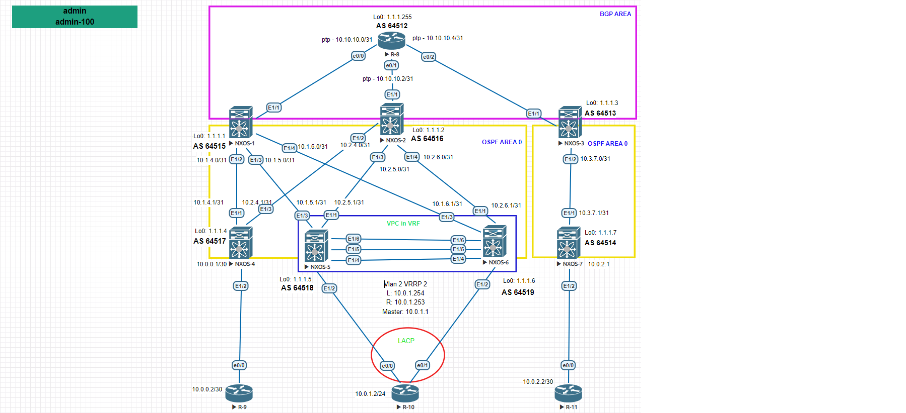

Цель: Настроить BGP для Underlay сети

1. Настроить BGP в Underlay сети, для IP связанности между всеми устройствами NXOS.
2. Проверка связности между сетями расположенных в одной локации, так и между локациями.
3. Предоставить вывод таблиц маршрутизации с утройств.

Пояснение. На схеме отражена распределенная сеть построенная на базе протокола OSPF. Внутрение сети доступны через OSPF, которые редистрибьютятся в BGP.  Связь между сетями происходит через единый маршрутизатор R-8.

В выводе убраны все настройки не относящиеся к поставленной задаче.

Настройка маршрутизатора R-8:

R-8

<pre><code>

interface Loopback0
 ip address 1.1.1.255 255.255.255.255
!
interface Ethernet0/0
 ip address 10.10.10.0 255.255.255.254
!
interface Ethernet0/1
 ip address 10.10.10.2 255.255.255.254
!
interface Ethernet0/2
 ip address 10.10.10.4 255.255.255.254
!
interface Ethernet0/3
 no ip address
!
router ospf 1
 router-id 1.1.1.255
 passive-interface default
 no passive-interface Ethernet0/0
 no passive-interface Ethernet0/1
 no passive-interface Ethernet0/2
 network 1.1.1.255 0.0.0.0 area 0
 network 10.10.10.0 0.0.0.1 area 0
 network 10.10.10.2 0.0.0.1 area 0
 network 10.10.10.4 0.0.0.1 area 0
!
router bgp 64512
 bgp router-id 1.1.1.255
 bgp log-neighbor-changes
 bgp bestpath as-path multipath-relax
 network 1.1.1.255 mask 255.255.255.255
 neighbor 10.10.10.1 remote-as 64515
 neighbor 10.10.10.1 soft-reconfiguration inbound
 neighbor 10.10.10.3 remote-as 64516
 neighbor 10.10.10.3 soft-reconfiguration inbound
 neighbor 10.10.10.5 remote-as 64513
 neighbor 10.10.10.5 soft-reconfiguration inbound
 maximum-paths eibgp 4

</code></pre>

Настройка NEXUS:

NXOS-1

<pre><code>
SPINE-1# show run

feature ospf
feature bgp
feature interface-vlan
feature hsrp
feature lacp
feature vpc

interface Ethernet1/1
  no switchport
  ip address 10.10.10.1/31
  no shutdown

interface Ethernet1/2
  no switchport
  medium p2p
  ip address 10.1.4.0/31
  ip router ospf UNDERLAY area 0.0.0.0
  no shutdown

interface Ethernet1/3
  no switchport
  medium p2p
  ip address 10.1.5.0/31
  ip router ospf UNDERLAY area 0.0.0.0
  no shutdown

interface Ethernet1/4
  no switchport
  medium p2p
  ip address 10.1.6.0/31
  ip router ospf UNDERLAY area 0.0.0.0
  no shutdown

interface loopback0
  ip address 1.1.1.1/32
  ip router ospf UNDERLAY area 0.0.0.0
cli alias name wr copy running-config startup-config
line console
line vty
boot nxos bootflash:/nxos.9.2.2.bin
router ospf UNDERLAY
  router-id 1.1.1.1
  log-adjacency-changes detail
router bgp 64515
  router-id 1.1.1.1
  bestpath as-path multipath-relax
  log-neighbor-changes
  address-family ipv4 unicast
    network 1.1.1.1/32
    maximum-paths 4
  template peer LEAF
    address-family ipv4 unicast
      maximum-prefix 100
  neighbor 10.1.4.1
    inherit peer LEAF
    remote-as 64517
  neighbor 10.1.5.1
    inherit peer LEAF
    remote-as 64518
  neighbor 10.1.6.1
    inherit peer LEAF
    remote-as 64519
  neighbor 10.10.10.0
    remote-as 64512
    address-family ipv4 unicast
      maximum-prefix 200
</code></pre>

NXOS-2

<pre><code>
SPINE-2# show run

cfs eth distribute
feature ospf
feature bgp
feature interface-vlan
feature hsrp
feature lacp
feature vpc

route-map direct permit 10
  match source-protocol UNDERLAY

interface Ethernet1/1
  no switchport
  ip address 10.10.10.3/31
  no shutdown

interface Ethernet1/2
  no switchport
  medium p2p
  ip address 10.2.4.0/31
  ip router ospf UNDERLAY area 0.0.0.0
  no shutdown

interface Ethernet1/3
  no switchport
  medium p2p
  ip address 10.2.5.0/31
  ip router ospf UNDERLAY area 0.0.0.0
  no shutdown

interface Ethernet1/4
  no switchport
  medium p2p
  ip address 10.2.6.0/31
  ip router ospf UNDERLAY area 0.0.0.0
  no shutdown

interface loopback0
  ip address 1.1.1.2/32
  ip router ospf UNDERLAY area 0.0.0.0
cli alias name wr copy running-config startup-config
line console
line vty
boot nxos bootflash:/nxos.9.2.2.bin
router ospf UNDERLAY
  router-id 1.1.1.2
  log-adjacency-changes detail
router bgp 64516
  router-id 1.1.1.2
  bestpath as-path multipath-relax
  log-neighbor-changes
  address-family ipv4 unicast
    network 1.1.1.2/32
    maximum-paths 4
  template peer LEAF
    address-family ipv4 unicast
      maximum-prefix 100
  neighbor 10.2.4.1
    inherit peer LEAF
    remote-as 64517
  neighbor 10.2.5.1
    inherit peer LEAF
    remote-as 64518
  neighbor 10.2.6.1
    inherit peer LEAF
    remote-as 64519
  neighbor 10.10.10.2
    remote-as 64512
    address-family ipv4 unicast
      maximum-prefix 200

</code></pre>

NXOS-3

<pre><code>

feature ospf
feature bgp
feature interface-vlan
feature hsrp
feature lacp
feature vpc

route-map direct permit 1
  match source-protocol UNDERLAY

interface Ethernet1/1
  no switchport
  ip address 10.10.10.5/31
  no shutdown

interface Ethernet1/2
  no switchport
  medium p2p
  ip address 10.3.7.0/31
  ip router ospf UNDERLAY area 0.0.0.3
  no shutdown

interface loopback0
  ip address 1.1.1.3/32
  ip router ospf UNDERLAY area 0.0.0.0
cli alias name wr copy running-config startup-config
line console
line vty
boot nxos bootflash:/nxos.9.2.2.bin
router ospf UNDERLAY
  router-id 1.1.1.3
  log-adjacency-changes detail
router bgp 64513
  router-id 1.1.1.3
  bestpath as-path multipath-relax
  log-neighbor-changes
  address-family ipv4 unicast
    network 1.1.1.3/32
    redistribute direct route-map direct
    maximum-paths 4
  neighbor 10.3.7.1
    remote-as 64514
    address-family ipv4 unicast
      maximum-prefix 100
  neighbor 10.10.10.4
    remote-as 64512
    address-family ipv4 unicast
      maximum-prefix 200
</code></pre>

NXOS-4

<pre><code>
LEAF-4#  show run

cfs eth distribute
feature ospf
feature bgp
feature interface-vlan
feature hsrp
feature lacp
feature vpc

ip prefix-list redistribute_list seq 5 permit 10.0.0.0/30
route-map OSPF-redistribute permit 10
  match ip address prefix-list redistribute_list
route-map direct permit 10
  match source-protocol direct
vrf context management

interface Ethernet1/1
  no switchport
  medium p2p
  ip address 10.1.4.1/31
  ip router ospf UNDERLAY area 0.0.0.0
  no shutdown

interface Ethernet1/2
  no switchport
  ip address 10.0.0.1/30
  no shutdown

interface Ethernet1/3
  no switchport
  medium p2p
  ip address 10.2.4.1/31
  ip router ospf UNDERLAY area 0.0.0.0
  no shutdown

interface loopback0
  ip address 1.1.1.4/32
  ip router ospf UNDERLAY area 0.0.0.0
cli alias name wr copy running-config startup-config
line console
line vty
boot nxos bootflash:/nxos.9.2.2.bin
router ospf UNDERLAY
  router-id 1.1.1.4
  redistribute direct route-map OSPF-redistribute
  log-adjacency-changes detail
router bgp 64517
  router-id 1.1.1.4
  bestpath as-path multipath-relax
  log-neighbor-changes
  address-family ipv4 unicast
    network 1.1.1.4/32
    redistribute direct route-map direct
    maximum-paths 4
  template peer SPINE
    address-family ipv4 unicast
      maximum-prefix 100
  neighbor 10.1.4.0
    inherit peer SPINE
    remote-as 64515
  neighbor 10.2.4.0
    inherit peer SPINE
    remote-as 64516

</code></pre>

NXOS-5

<pre><code>
LEAF-5#  show run

feature vrrp
cfs eth distribute
feature ospf
feature bgp
feature interface-vlan
feature hsrp
feature lacp
feature vpc

vlan 1-2
vlan 2
  name Client-Vlan2

ip prefix-list redistribute_list seq 5 permit 10.0.1.0/24
route-map OSPF-redistribute permit 10
  match ip address prefix-list redistribute_list
route-map direct permit 10
  match source-protocol direct
vrf context VPC
vrf context management
vpc domain 1
  role priority 100
  peer-keepalive destination 10.200.100.2 source 10.200.100.1 vrf VPC

interface Vlan2
  no shutdown
  ip address 10.0.1.254/24
  vrrp 2
    priority 1
    address 10.0.1.1
    no shutdown

interface port-channel1
  description *** VPC PEERLINK ***
  switchport mode trunk
  spanning-tree port type network
  vpc peer-link

interface port-channel2
  switchport access vlan 2
  vpc 1

interface Ethernet1/1
  no switchport
  medium p2p
  ip address 10.2.5.1/31
  ip router ospf UNDERLAY area 0.0.0.0
  no shutdown

interface Ethernet1/2
  switchport access vlan 2
  channel-group 2 mode active

interface Ethernet1/3
  no switchport
  medium p2p
  ip address 10.1.5.1/31
  ip router ospf UNDERLAY area 0.0.0.0
  no shutdown

interface Ethernet1/4
  description *** VPC KEEPALIVE LINK ***
  no switchport
  vrf member VPC
  ip address 10.200.100.1/24
  no shutdown

interface Ethernet1/5
  switchport mode trunk
  channel-group 1 mode active

interface Ethernet1/6
  switchport mode trunk
  channel-group 1 mode active

interface loopback0
  ip address 1.1.1.5/32
  ip router ospf UNDERLAY area 0.0.0.0
cli alias name wr copy running-config startup-config
line console
line vty
boot nxos bootflash:/nxos.9.2.2.bin
router ospf UNDERLAY
  router-id 1.1.1.5
  redistribute direct route-map OSPF-redistribute
  log-adjacency-changes detail
router bgp 64518
  router-id 1.1.1.5
  bestpath as-path multipath-relax
  log-neighbor-changes
  address-family ipv4 unicast
    network 1.1.1.5/32
    redistribute direct route-map direct
    maximum-paths 4
  template peer SPINE
    address-family ipv4 unicast
      maximum-prefix 100
  neighbor 10.1.5.0
    inherit peer SPINE
    remote-as 64515
  neighbor 10.2.5.0
    inherit peer SPINE
    remote-as 64516

</code></pre>

NXOS-6

<pre><code>
LEAF-6#   show run

feature vrrp
cfs eth distribute
feature ospf
feature bgp
feature interface-vlan
feature hsrp
feature lacp
feature vpc

vlan 1-2
vlan 2
  name Client-Vlan2

ip prefix-list redistribute_list seq 5 permit 10.0.1.0/24
route-map OSPF-redistribute permit 10
  match ip address prefix-list redistribute_list
route-map direct permit 10
  match source-protocol direct
vrf context VPC
vrf context management
vpc domain 1
  role priority 1
  peer-keepalive destination 10.200.100.1 source 10.200.100.2 vrf VPC

interface Vlan2
  no shutdown
  ip address 10.0.1.253/24
  vrrp 2
    priority 2
    address 10.0.1.1
    no shutdown

interface port-channel1
  description *** VPC PEERLINK ***
  switchport mode trunk
  spanning-tree port type network
  vpc peer-link

interface port-channel2
  switchport access vlan 2
  vpc 1

interface Ethernet1/1
  no switchport
  medium p2p
  ip address 10.2.6.1/31
  ip router ospf UNDERLAY area 0.0.0.0
  no shutdown

interface Ethernet1/2
  switchport access vlan 2
  channel-group 2 mode active

interface Ethernet1/3
  no switchport
  medium p2p
  ip address 10.1.6.1/31
  ip router ospf UNDERLAY area 0.0.0.0
  no shutdown

interface Ethernet1/4
  description *** VPC KEEPALIVE LINK ***
  no switchport
  vrf member VPC
  ip address 10.200.100.2/24
  no shutdown

interface Ethernet1/5
  switchport mode trunk
  channel-group 1 mode active

interface Ethernet1/6
  switchport mode trunk
  channel-group 1 mode active

interface loopback0
  ip address 1.1.1.6/32
  ip router ospf UNDERLAY area 0.0.0.0
cli alias name wr copy running-config startup-config
line console
line vty
boot nxos bootflash:/nxos.9.2.2.bin
router ospf UNDERLAY
  router-id 1.1.1.6
  redistribute direct route-map OSPF-redistribute
  log-adjacency-changes detail
router bgp 64519
  router-id 1.1.1.6
  bestpath as-path multipath-relax
  log-neighbor-changes
  address-family ipv4 unicast
    network 1.1.1.6/32
    redistribute direct route-map direct
    maximum-paths 4
  template peer SPINE
    address-family ipv4 unicast
      maximum-prefix 100
  neighbor 10.1.6.0
    inherit peer SPINE
    remote-as 64515
  neighbor 10.2.6.0
    inherit peer SPINE
    remote-as 64516

</code></pre>

NXOS-7

<pre><code>
LEAF-7# show run

cfs eth distribute
feature ospf
feature bgp
feature interface-vlan
feature hsrp
feature lacp
feature vpc

ip prefix-list redistribute_list seq 5 permit 10.0.2.0/30
route-map OSPF-redistribute permit 10
  match ip address prefix-list redistribute_list
route-map direct permit 10
  match source-protocol direct
vrf context management

interface Ethernet1/1
  no switchport
  medium p2p
  ip address 10.3.7.1/31
  ip router ospf UNDERLAY area 0.0.0.3
  no shutdown

interface Ethernet1/2
  no switchport
  ip address 10.0.2.1/30
  no shutdown

interface loopback0
  ip address 1.1.1.7/32
  ip router ospf UNDERLAY area 0.0.0.3
cli alias name wr copy running-config startup-config
line console
line vty
boot nxos bootflash:/nxos.9.2.2.bin
router ospf UNDERLAY
  router-id 1.1.1.7
  redistribute direct route-map OSPF-redistribute
  log-adjacency-changes detail
router bgp 64514
  router-id 1.1.1.7
  log-neighbor-changes
  address-family ipv4 unicast
    network 1.1.1.7/32
    redistribute direct route-map direct
    maximum-paths 2
  neighbor 10.3.7.0
    remote-as 64513
    address-family ipv4 unicast
      maximum-prefix 100

</code></pre>

-----------------------------------------------------------------

Суммарная информация о BGP соседях с маршрутизатора R-8

<pre><code>

R-8#show ip bgp summary
Neighbor        V           AS MsgRcvd MsgSent   TblVer  InQ OutQ Up/Down  State/PfxRcd
10.10.10.1      4        64515      19      24       20    0    0 00:07:25       13
10.10.10.3      4        64516      19      24       20    0    0 00:07:24       13
10.10.10.5      4        64513      15      24       20    0    0 00:07:23        5

</code></pre>

Маршрутная таблица с R-8

<pre><code>
1.0.0.0/32 is subnetted, 8 subnets
B        1.1.1.1 [20/0] via 10.10.10.1, 00:08:54
B        1.1.1.2 [20/0] via 10.10.10.3, 00:08:54
B        1.1.1.3 [20/0] via 10.10.10.5, 00:08:54
B        1.1.1.4 [20/0] via 10.10.10.3, 00:08:54
           [20/0] via 10.10.10.1, 00:08:54
B        1.1.1.5 [20/0] via 10.10.10.3, 00:08:54
           [20/0] via 10.10.10.1, 00:08:54
B        1.1.1.6 [20/0] via 10.10.10.3, 00:08:54
           [20/0] via 10.10.10.1, 00:08:54
B        1.1.1.7 [20/0] via 10.10.10.5, 00:08:54
C        1.1.1.255 is directly connected, Loopback0
10.0.0.0/8 is variably subnetted, 16 subnets, 4 masks
B        10.0.0.0/30 [20/0] via 10.10.10.3, 00:08:54
               [20/0] via 10.10.10.1, 00:08:54
B        10.0.1.0/24 [20/0] via 10.10.10.3, 00:08:54
               [20/0] via 10.10.10.1, 00:08:54
B        10.0.2.0/30 [20/0] via 10.10.10.5, 00:08:54
B        10.1.4.0/31 [20/0] via 10.10.10.3, 00:08:54
               [20/0] via 10.10.10.1, 00:08:54
B        10.1.5.0/31 [20/0] via 10.10.10.3, 00:08:54
               [20/0] via 10.10.10.1, 00:08:54
B        10.1.6.0/31 [20/0] via 10.10.10.3, 00:08:54
               [20/0] via 10.10.10.1, 00:08:54
B        10.2.4.0/31 [20/0] via 10.10.10.3, 00:08:54
               [20/0] via 10.10.10.1, 00:08:54
B        10.2.5.0/31 [20/0] via 10.10.10.3, 00:08:54
               [20/0] via 10.10.10.1, 00:08:54
B        10.2.6.0/31 [20/0] via 10.10.10.3, 00:08:54
               [20/0] via 10.10.10.1, 00:08:54
B        10.3.7.0/31 [20/0] via 10.10.10.5, 00:08:54
C        10.10.10.0/31 is directly connected, Ethernet0/0
L        10.10.10.0/32 is directly connected, Ethernet0/0
C        10.10.10.2/31 is directly connected, Ethernet0/1
L        10.10.10.2/32 is directly connected, Ethernet0/1
C        10.10.10.4/31 is directly connected, Ethernet0/2
L        10.10.10.4/32 is directly connected, Ethernet0/2

</code></pre>

Маршрутная таблица с NXOS-1

<pre><code>
1.1.1.1/32, ubest/mbest: 2/0, attached
    *via 1.1.1.1, Lo0, [0/0], 02:29:51, local
    *via 1.1.1.1, Lo0, [0/0], 02:29:50, direct
1.1.1.2/32, ubest/mbest: 4/0
    *via 10.1.4.1, [20/0], 00:19:59, bgp-64515, external, tag 64517
    *via 10.1.5.1, [20/0], 00:19:59, bgp-64515, external, tag 64518
    *via 10.1.6.1, [20/0], 00:19:59, bgp-64515, external, tag 64519
    *via 10.10.10.0, [20/0], 00:19:59, bgp-64515, external, tag 64512
1.1.1.3/32, ubest/mbest: 1/0
    *via 10.10.10.0, [20/0], 00:19:59, bgp-64515, external, tag 64512
1.1.1.4/32, ubest/mbest: 1/0
    *via 10.1.4.1, [20/0], 00:45:21, bgp-64515, external, tag 64517
1.1.1.5/32, ubest/mbest: 1/0
    *via 10.1.5.1, [20/0], 00:45:21, bgp-64515, external, tag 64518
1.1.1.6/32, ubest/mbest: 1/0
    *via 10.1.6.1, [20/0], 00:45:21, bgp-64515, external, tag 64519
1.1.1.7/32, ubest/mbest: 1/0
    *via 10.10.10.0, [20/0], 00:19:59, bgp-64515, external, tag 64512
1.1.1.255/32, ubest/mbest: 1/0
    *via 10.10.10.0, [20/0], 00:19:32, bgp-64515, external, tag 64512
10.0.0.0/30, ubest/mbest: 1/0
    *via 10.1.4.1, [20/0], 00:45:21, bgp-64515, external, tag 64517
10.0.1.0/24, ubest/mbest: 2/0
    *via 10.1.5.1, [20/0], 00:45:21, bgp-64515, external, tag 64518
    *via 10.1.6.1, [20/0], 00:45:21, bgp-64515, external, tag 64519
10.0.2.0/30, ubest/mbest: 1/0
    *via 10.10.10.0, [20/0], 00:19:59, bgp-64515, external, tag 64512
10.1.4.0/31, ubest/mbest: 1/0, attached
    *via 10.1.4.0, Eth1/2, [0/0], 02:28:31, direct
10.1.4.0/32, ubest/mbest: 1/0, attached
    *via 10.1.4.0, Eth1/2, [0/0], 02:28:31, local
10.1.5.0/31, ubest/mbest: 1/0, attached
    *via 10.1.5.0, Eth1/3, [0/0], 02:28:30, direct
10.1.5.0/32, ubest/mbest: 1/0, attached
    *via 10.1.5.0, Eth1/3, [0/0], 02:28:30, local
10.1.6.0/31, ubest/mbest: 1/0, attached
    *via 10.1.6.0, Eth1/4, [0/0], 02:28:30, direct
10.1.6.0/32, ubest/mbest: 1/0, attached
    *via 10.1.6.0, Eth1/4, [0/0], 02:28:30, local
10.2.4.0/31, ubest/mbest: 1/0
    *via 10.1.4.1, [20/0], 00:45:21, bgp-64515, external, tag 64517
10.2.5.0/31, ubest/mbest: 1/0
    *via 10.1.5.1, [20/0], 00:45:21, bgp-64515, external, tag 64518
10.2.6.0/31, ubest/mbest: 1/0
    *via 10.1.6.1, [20/0], 00:45:21, bgp-64515, external, tag 64519
10.3.7.0/31, ubest/mbest: 1/0
    *via 10.10.10.0, [20/0], 00:19:59, bgp-64515, external, tag 64512
10.10.10.0/31, ubest/mbest: 1/0, attached
    *via 10.10.10.1, Eth1/1, [0/0], 02:28:31, direct
10.10.10.1/32, ubest/mbest: 1/0, attached
    *via 10.10.10.1, Eth1/1, [0/0], 02:28:31, local
10.10.10.4/31, ubest/mbest: 1/0
    *via 10.10.10.0, [20/0], 00:19:59, bgp-64515, external, tag 64512
</code></pre>

Маршрутная таблица с NXOS-2

<pre><code>
1.1.1.1/32, ubest/mbest: 4/0
    *via 10.2.4.1, [20/0], 00:22:10, bgp-64516, external, tag 64517
    *via 10.2.5.1, [20/0], 00:22:10, bgp-64516, external, tag 64518
    *via 10.2.6.1, [20/0], 00:22:10, bgp-64516, external, tag 64519
    *via 10.10.10.2, [20/0], 00:22:10, bgp-64516, external, tag 64512
1.1.1.2/32, ubest/mbest: 2/0, attached
    *via 1.1.1.2, Lo0, [0/0], 02:32:11, local
    *via 1.1.1.2, Lo0, [0/0], 02:32:11, direct
1.1.1.3/32, ubest/mbest: 1/0
    *via 10.10.10.2, [20/0], 00:22:10, bgp-64516, external, tag 64512
1.1.1.4/32, ubest/mbest: 1/0
    *via 10.2.4.1, [20/0], 00:36:58, bgp-64516, external, tag 64517
1.1.1.5/32, ubest/mbest: 1/0
    *via 10.2.5.1, [20/0], 00:36:58, bgp-64516, external, tag 64518
1.1.1.6/32, ubest/mbest: 1/0
    *via 10.2.6.1, [20/0], 00:36:58, bgp-64516, external, tag 64519
1.1.1.7/32, ubest/mbest: 1/0
    *via 10.10.10.2, [20/0], 00:22:10, bgp-64516, external, tag 64512
1.1.1.255/32, ubest/mbest: 1/0
    *via 10.10.10.2, [20/0], 00:21:44, bgp-64516, external, tag 64512
10.0.0.0/30, ubest/mbest: 1/0
    *via 10.2.4.1, [20/0], 00:36:58, bgp-64516, external, tag 64517
10.0.1.0/24, ubest/mbest: 2/0
    *via 10.2.5.1, [20/0], 00:36:58, bgp-64516, external, tag 64518
    *via 10.2.6.1, [20/0], 00:36:58, bgp-64516, external, tag 64519
10.0.2.0/30, ubest/mbest: 1/0
    *via 10.10.10.2, [20/0], 00:22:10, bgp-64516, external, tag 64512
10.1.4.0/31, ubest/mbest: 1/0
    *via 10.2.4.1, [20/0], 00:36:58, bgp-64516, external, tag 64517
10.1.5.0/31, ubest/mbest: 1/0
    *via 10.2.5.1, [20/0], 00:36:58, bgp-64516, external, tag 64518
10.1.6.0/31, ubest/mbest: 1/0
    *via 10.2.6.1, [20/0], 00:36:58, bgp-64516, external, tag 64519
10.2.4.0/31, ubest/mbest: 1/0, attached
    *via 10.2.4.0, Eth1/2, [0/0], 02:30:39, direct
10.2.4.0/32, ubest/mbest: 1/0, attached
    *via 10.2.4.0, Eth1/2, [0/0], 02:30:39, local
10.2.5.0/31, ubest/mbest: 1/0, attached
    *via 10.2.5.0, Eth1/3, [0/0], 02:30:39, direct
10.2.5.0/32, ubest/mbest: 1/0, attached
    *via 10.2.5.0, Eth1/3, [0/0], 02:30:39, local
10.2.6.0/31, ubest/mbest: 1/0, attached
    *via 10.2.6.0, Eth1/4, [0/0], 02:30:39, direct
10.2.6.0/32, ubest/mbest: 1/0, attached
    *via 10.2.6.0, Eth1/4, [0/0], 02:30:39, local
10.3.7.0/31, ubest/mbest: 1/0
    *via 10.10.10.2, [20/0], 00:22:10, bgp-64516, external, tag 64512
10.10.10.2/31, ubest/mbest: 1/0, attached
    *via 10.10.10.3, Eth1/1, [0/0], 02:30:40, direct
10.10.10.3/32, ubest/mbest: 1/0, attached
    *via 10.10.10.3, Eth1/1, [0/0], 02:30:40, local
10.10.10.4/31, ubest/mbest: 1/0
    *via 10.10.10.2, [20/0], 00:22:10, bgp-64516, external, tag 64512
</code></pre>

Маршрутная таблица с NXOS-3

<pre><code>
1.1.1.1/32, ubest/mbest: 1/0
    *via 10.10.10.4, [20/0], 00:25:44, bgp-64513, external, tag 64512
1.1.1.2/32, ubest/mbest: 1/0
    *via 10.10.10.4, [20/0], 00:25:44, bgp-64513, external, tag 64512
1.1.1.3/32, ubest/mbest: 2/0, attached
    *via 1.1.1.3, Lo0, [0/0], 02:35:35, local
    *via 1.1.1.3, Lo0, [0/0], 02:35:34, direct
1.1.1.4/32, ubest/mbest: 1/0
    *via 10.10.10.4, [20/0], 00:25:44, bgp-64513, external, tag 64512
1.1.1.5/32, ubest/mbest: 1/0
    *via 10.10.10.4, [20/0], 00:25:44, bgp-64513, external, tag 64512
1.1.1.6/32, ubest/mbest: 1/0
    *via 10.10.10.4, [20/0], 00:25:44, bgp-64513, external, tag 64512
1.1.1.7/32, ubest/mbest: 1/0
    *via 10.3.7.1, [20/0], 00:39:06, bgp-64513, external, tag 64514
1.1.1.255/32, ubest/mbest: 1/0
    *via 10.10.10.4, [20/0], 00:25:13, bgp-64513, external, tag 64512
10.0.0.0/30, ubest/mbest: 1/0
    *via 10.10.10.4, [20/0], 00:25:44, bgp-64513, external, tag 64512
10.0.1.0/24, ubest/mbest: 1/0
    *via 10.10.10.4, [20/0], 00:25:44, bgp-64513, external, tag 64512
10.0.2.0/30, ubest/mbest: 1/0
    *via 10.3.7.1, [20/0], 00:39:06, bgp-64513, external, tag 64514
10.1.4.0/31, ubest/mbest: 1/0
    *via 10.10.10.4, [20/0], 00:25:44, bgp-64513, external, tag 64512
10.1.5.0/31, ubest/mbest: 1/0
    *via 10.10.10.4, [20/0], 00:25:44, bgp-64513, external, tag 64512
10.1.6.0/31, ubest/mbest: 1/0
    *via 10.10.10.4, [20/0], 00:25:44, bgp-64513, external, tag 64512
10.2.4.0/31, ubest/mbest: 1/0
    *via 10.10.10.4, [20/0], 00:25:44, bgp-64513, external, tag 64512
10.2.5.0/31, ubest/mbest: 1/0
    *via 10.10.10.4, [20/0], 00:25:44, bgp-64513, external, tag 64512
10.2.6.0/31, ubest/mbest: 1/0
    *via 10.10.10.4, [20/0], 00:25:44, bgp-64513, external, tag 64512
10.3.7.0/31, ubest/mbest: 1/0, attached
    *via 10.3.7.0, Eth1/2, [0/0], 02:33:55, direct
10.3.7.0/32, ubest/mbest: 1/0, attached
    *via 10.3.7.0, Eth1/2, [0/0], 02:33:55, local
10.10.10.4/31, ubest/mbest: 1/0, attached
    *via 10.10.10.5, Eth1/1, [0/0], 02:33:55, direct
10.10.10.5/32, ubest/mbest: 1/0, attached
    *via 10.10.10.5, Eth1/1, [0/0], 02:33:55, local
</code></pre>

Маршрутная таблица с NXOS-4

<pre><code>
1.1.1.1/32, ubest/mbest: 1/0
    *via 10.1.4.0, [20/0], 00:39:01, bgp-64517, external, tag 64515
1.1.1.2/32, ubest/mbest: 1/0
    *via 10.2.4.0, [20/0], 00:39:01, bgp-64517, external, tag 64516
1.1.1.3/32, ubest/mbest: 2/0
    *via 10.1.4.0, [20/0], 00:26:41, bgp-64517, external, tag 64515
    *via 10.2.4.0, [20/0], 00:26:41, bgp-64517, external, tag 64516
1.1.1.4/32, ubest/mbest: 2/0, attached
    *via 1.1.1.4, Lo0, [0/0], 02:37:06, local
    *via 1.1.1.4, Lo0, [0/0], 02:37:06, direct
1.1.1.5/32, ubest/mbest: 2/0
    *via 10.1.4.0, [20/0], 00:39:01, bgp-64517, external, tag 64515
    *via 10.2.4.0, [20/0], 00:39:01, bgp-64517, external, tag 64516
1.1.1.6/32, ubest/mbest: 2/0
    *via 10.1.4.0, [20/0], 00:39:01, bgp-64517, external, tag 64515
    *via 10.2.4.0, [20/0], 00:39:01, bgp-64517, external, tag 64516
1.1.1.7/32, ubest/mbest: 2/0
    *via 10.1.4.0, [20/0], 00:26:41, bgp-64517, external, tag 64515
    *via 10.2.4.0, [20/0], 00:26:41, bgp-64517, external, tag 64516
1.1.1.255/32, ubest/mbest: 2/0
    *via 10.1.4.0, [20/0], 00:26:10, bgp-64517, external, tag 64515
    *via 10.2.4.0, [20/0], 00:26:10, bgp-64517, external, tag 64516
10.0.0.0/30, ubest/mbest: 1/0, attached
    *via 10.0.0.1, Eth1/2, [0/0], 02:35:37, direct
10.0.0.1/32, ubest/mbest: 1/0, attached
    *via 10.0.0.1, Eth1/2, [0/0], 02:35:37, local
10.0.1.0/24, ubest/mbest: 2/0
    *via 10.1.4.0, [20/0], 00:39:01, bgp-64517, external, tag 64515
    *via 10.2.4.0, [20/0], 00:39:01, bgp-64517, external, tag 64516
10.0.2.0/30, ubest/mbest: 2/0
    *via 10.1.4.0, [20/0], 00:26:41, bgp-64517, external, tag 64515
    *via 10.2.4.0, [20/0], 00:26:41, bgp-64517, external, tag 64516
10.1.4.0/31, ubest/mbest: 1/0, attached
    *via 10.1.4.1, Eth1/1, [0/0], 02:35:37, direct
10.1.4.1/32, ubest/mbest: 1/0, attached
    *via 10.1.4.1, Eth1/1, [0/0], 02:35:38, local
10.1.5.0/31, ubest/mbest: 2/0
    *via 10.1.4.0, [20/0], 00:39:01, bgp-64517, external, tag 64515
    *via 10.2.4.0, [20/0], 00:39:01, bgp-64517, external, tag 64516
10.1.6.0/31, ubest/mbest: 2/0
    *via 10.1.4.0, [20/0], 00:39:01, bgp-64517, external, tag 64515
    *via 10.2.4.0, [20/0], 00:39:01, bgp-64517, external, tag 64516
10.2.4.0/31, ubest/mbest: 1/0, attached
    *via 10.2.4.1, Eth1/3, [0/0], 02:35:37, direct
10.2.4.1/32, ubest/mbest: 1/0, attached
    *via 10.2.4.1, Eth1/3, [0/0], 02:35:37, local
10.2.5.0/31, ubest/mbest: 2/0
    *via 10.1.4.0, [20/0], 00:39:01, bgp-64517, external, tag 64515
    *via 10.2.4.0, [20/0], 00:39:01, bgp-64517, external, tag 64516
10.2.6.0/31, ubest/mbest: 2/0
    *via 10.1.4.0, [20/0], 00:39:01, bgp-64517, external, tag 64515
    *via 10.2.4.0, [20/0], 00:39:01, bgp-64517, external, tag 64516
10.3.7.0/31, ubest/mbest: 2/0
    *via 10.1.4.0, [20/0], 00:26:41, bgp-64517, external, tag 64515
    *via 10.2.4.0, [20/0], 00:26:41, bgp-64517, external, tag 64516
10.10.10.4/31, ubest/mbest: 2/0
    *via 10.1.4.0, [20/0], 00:26:41, bgp-64517, external, tag 64515
    *via 10.2.4.0, [20/0], 00:26:41, bgp-64517, external, tag 64516
</code></pre>

Маршрутная таблица с NXOS-5

<pre><code>
1.1.1.1/32, ubest/mbest: 1/0
    *via 10.1.5.0, [20/0], 00:51:44, bgp-64518, external, tag 64515
1.1.1.2/32, ubest/mbest: 1/0
    *via 10.2.5.0, [20/0], 00:51:44, bgp-64518, external, tag 64516
1.1.1.3/32, ubest/mbest: 2/0
    *via 10.1.5.0, [20/0], 00:40:27, bgp-64518, external, tag 64515
    *via 10.2.5.0, [20/0], 00:40:27, bgp-64518, external, tag 64516
1.1.1.4/32, ubest/mbest: 2/0
    *via 10.1.5.0, [20/0], 00:51:44, bgp-64518, external, tag 64515
    *via 10.2.5.0, [20/0], 00:51:44, bgp-64518, external, tag 64516
1.1.1.5/32, ubest/mbest: 2/0, attached
    *via 1.1.1.5, Lo0, [0/0], 02:48:18, local
    *via 1.1.1.5, Lo0, [0/0], 02:48:18, direct
1.1.1.6/32, ubest/mbest: 2/0
    *via 10.1.5.0, [20/0], 00:51:44, bgp-64518, external, tag 64515
    *via 10.2.5.0, [20/0], 00:51:44, bgp-64518, external, tag 64516
1.1.1.7/32, ubest/mbest: 2/0
    *via 10.1.5.0, [20/0], 00:40:27, bgp-64518, external, tag 64515
    *via 10.2.5.0, [20/0], 00:40:27, bgp-64518, external, tag 64516
1.1.1.255/32, ubest/mbest: 2/0
    *via 10.1.5.0, [20/0], 00:39:57, bgp-64518, external, tag 64515
    *via 10.2.5.0, [20/0], 00:39:57, bgp-64518, external, tag 64516
10.0.0.0/30, ubest/mbest: 2/0
    *via 10.1.5.0, [20/0], 00:51:44, bgp-64518, external, tag 64515
    *via 10.2.5.0, [20/0], 00:51:44, bgp-64518, external, tag 64516
10.0.1.0/24, ubest/mbest: 1/0, attached
    *via 10.0.1.254, Vlan2, [0/0], 01:18:25, direct
10.0.1.1/32, ubest/mbest: 1/0, attached
    *via 10.0.1.1, Vlan2, [0/0], 01:18:25, vrrp_engine
10.0.1.254/32, ubest/mbest: 1/0, attached
    *via 10.0.1.254, Vlan2, [0/0], 01:18:25, local
10.0.2.0/30, ubest/mbest: 2/0
    *via 10.1.5.0, [20/0], 00:40:27, bgp-64518, external, tag 64515
    *via 10.2.5.0, [20/0], 00:40:27, bgp-64518, external, tag 64516
10.1.4.0/31, ubest/mbest: 2/0
    *via 10.1.5.0, [20/0], 00:51:44, bgp-64518, external, tag 64515
    *via 10.2.5.0, [20/0], 00:51:44, bgp-64518, external, tag 64516
10.1.5.0/31, ubest/mbest: 1/0, attached
    *via 10.1.5.1, Eth1/3, [0/0], 02:47:14, direct
10.1.5.1/32, ubest/mbest: 1/0, attached
    *via 10.1.5.1, Eth1/3, [0/0], 02:47:14, local
10.1.6.0/31, ubest/mbest: 2/0
    *via 10.1.5.0, [20/0], 00:51:44, bgp-64518, external, tag 64515
    *via 10.2.5.0, [20/0], 00:51:44, bgp-64518, external, tag 64516
10.2.4.0/31, ubest/mbest: 2/0
    *via 10.1.5.0, [20/0], 00:51:44, bgp-64518, external, tag 64515
    *via 10.2.5.0, [20/0], 00:51:44, bgp-64518, external, tag 64516
10.2.5.0/31, ubest/mbest: 1/0, attached
    *via 10.2.5.1, Eth1/1, [0/0], 02:47:14, direct
10.2.5.1/32, ubest/mbest: 1/0, attached
    *via 10.2.5.1, Eth1/1, [0/0], 02:47:14, local
10.2.6.0/31, ubest/mbest: 2/0
    *via 10.1.5.0, [20/0], 00:51:44, bgp-64518, external, tag 64515
    *via 10.2.5.0, [20/0], 00:51:44, bgp-64518, external, tag 64516
10.3.7.0/31, ubest/mbest: 2/0
    *via 10.1.5.0, [20/0], 00:40:27, bgp-64518, external, tag 64515
    *via 10.2.5.0, [20/0], 00:40:27, bgp-64518, external, tag 64516
10.10.10.4/31, ubest/mbest: 2/0
    *via 10.1.5.0, [20/0], 00:40:27, bgp-64518, external, tag 64515
    *via 10.2.5.0, [20/0], 00:40:27, bgp-64518, external, tag 64516

</code></pre>

Маршрутная таблица с NXOS-6

<pre><code>
1.1.1.1/32, ubest/mbest: 1/0
    *via 10.1.6.0, [20/0], 01:04:22, bgp-64519, external, tag 64515
1.1.1.2/32, ubest/mbest: 1/0
    *via 10.2.6.0, [20/0], 01:04:22, bgp-64519, external, tag 64516
1.1.1.3/32, ubest/mbest: 2/0
    *via 10.1.6.0, [20/0], 00:53:54, bgp-64519, external, tag 64515
    *via 10.2.6.0, [20/0], 00:53:54, bgp-64519, external, tag 64516
1.1.1.4/32, ubest/mbest: 2/0
    *via 10.1.6.0, [20/0], 01:04:22, bgp-64519, external, tag 64515
    *via 10.2.6.0, [20/0], 01:04:22, bgp-64519, external, tag 64516
1.1.1.5/32, ubest/mbest: 2/0
    *via 10.1.6.0, [20/0], 01:04:22, bgp-64519, external, tag 64515
    *via 10.2.6.0, [20/0], 01:04:22, bgp-64519, external, tag 64516
1.1.1.6/32, ubest/mbest: 2/0, attached
    *via 1.1.1.6, Lo0, [0/0], 03:04:11, local
    *via 1.1.1.6, Lo0, [0/0], 03:04:11, direct
1.1.1.7/32, ubest/mbest: 2/0
    *via 10.1.6.0, [20/0], 00:53:54, bgp-64519, external, tag 64515
    *via 10.2.6.0, [20/0], 00:53:54, bgp-64519, external, tag 64516
1.1.1.255/32, ubest/mbest: 2/0
    *via 10.1.6.0, [20/0], 00:53:23, bgp-64519, external, tag 64515
    *via 10.2.6.0, [20/0], 00:53:23, bgp-64519, external, tag 64516
10.0.0.0/30, ubest/mbest: 2/0
    *via 10.1.6.0, [20/0], 01:04:22, bgp-64519, external, tag 64515
    *via 10.2.6.0, [20/0], 01:04:22, bgp-64519, external, tag 64516
10.0.1.0/24, ubest/mbest: 1/0, attached
    *via 10.0.1.253, Vlan2, [0/0], 01:31:52, direct
10.0.1.1/32, ubest/mbest: 1/0, attached
    *via 10.0.1.1, Vlan2, [0/0], 01:31:48, vrrp_engine
10.0.1.253/32, ubest/mbest: 1/0, attached
    *via 10.0.1.253, Vlan2, [0/0], 01:31:52, local
10.0.2.0/30, ubest/mbest: 2/0
    *via 10.1.6.0, [20/0], 00:53:54, bgp-64519, external, tag 64515
    *via 10.2.6.0, [20/0], 00:53:54, bgp-64519, external, tag 64516
10.1.4.0/31, ubest/mbest: 2/0
    *via 10.1.6.0, [20/0], 01:04:22, bgp-64519, external, tag 64515
    *via 10.2.6.0, [20/0], 01:04:22, bgp-64519, external, tag 64516
10.1.5.0/31, ubest/mbest: 2/0
    *via 10.1.6.0, [20/0], 01:04:22, bgp-64519, external, tag 64515
    *via 10.2.6.0, [20/0], 01:04:22, bgp-64519, external, tag 64516
10.1.6.0/31, ubest/mbest: 1/0, attached
    *via 10.1.6.1, Eth1/3, [0/0], 03:02:19, direct
10.1.6.1/32, ubest/mbest: 1/0, attached
    *via 10.1.6.1, Eth1/3, [0/0], 03:02:19, local
10.2.4.0/31, ubest/mbest: 2/0
    *via 10.1.6.0, [20/0], 01:04:22, bgp-64519, external, tag 64515
    *via 10.2.6.0, [20/0], 01:04:22, bgp-64519, external, tag 64516
10.2.5.0/31, ubest/mbest: 2/0
    *via 10.1.6.0, [20/0], 01:04:22, bgp-64519, external, tag 64515
    *via 10.2.6.0, [20/0], 01:04:22, bgp-64519, external, tag 64516
10.2.6.0/31, ubest/mbest: 1/0, attached
    *via 10.2.6.1, Eth1/1, [0/0], 03:02:20, direct
10.2.6.1/32, ubest/mbest: 1/0, attached
    *via 10.2.6.1, Eth1/1, [0/0], 03:02:20, local
10.3.7.0/31, ubest/mbest: 2/0
    *via 10.1.6.0, [20/0], 00:53:54, bgp-64519, external, tag 64515
    *via 10.2.6.0, [20/0], 00:53:54, bgp-64519, external, tag 64516
10.10.10.4/31, ubest/mbest: 2/0
    *via 10.1.6.0, [20/0], 00:53:54, bgp-64519, external, tag 64515
    *via 10.2.6.0, [20/0], 00:53:54, bgp-64519, external, tag 64516
</code></pre>

Маршрутная таблица с NXOS-7

<pre><code>
1.1.1.1/32, ubest/mbest: 1/0
    *via 10.3.7.0, [20/0], 00:30:02, bgp-64514, external, tag 64513
1.1.1.2/32, ubest/mbest: 1/0
    *via 10.3.7.0, [20/0], 00:30:02, bgp-64514, external, tag 64513
1.1.1.3/32, ubest/mbest: 1/0
    *via 10.3.7.0, [20/0], 02:38:05, bgp-64514, external, tag 64513
1.1.1.4/32, ubest/mbest: 1/0
    *via 10.3.7.0, [20/0], 00:30:02, bgp-64514, external, tag 64513
1.1.1.5/32, ubest/mbest: 1/0
    *via 10.3.7.0, [20/0], 00:30:02, bgp-64514, external, tag 64513
1.1.1.6/32, ubest/mbest: 1/0
    *via 10.3.7.0, [20/0], 00:30:02, bgp-64514, external, tag 64513
1.1.1.7/32, ubest/mbest: 2/0, attached
    *via 1.1.1.7, Lo0, [0/0], 02:40:18, local
    *via 1.1.1.7, Lo0, [0/0], 02:40:17, direct
1.1.1.255/32, ubest/mbest: 1/0
    *via 10.3.7.0, [20/0], 00:29:31, bgp-64514, external, tag 64513
10.0.0.0/30, ubest/mbest: 1/0
    *via 10.3.7.0, [20/0], 00:30:02, bgp-64514, external, tag 64513
10.0.1.0/24, ubest/mbest: 1/0
    *via 10.3.7.0, [20/0], 00:30:02, bgp-64514, external, tag 64513
10.0.2.0/30, ubest/mbest: 1/0, attached
    *via 10.0.2.1, Eth1/2, [0/0], 02:38:48, direct
10.0.2.1/32, ubest/mbest: 1/0, attached
    *via 10.0.2.1, Eth1/2, [0/0], 02:38:48, local
10.1.4.0/31, ubest/mbest: 1/0
    *via 10.3.7.0, [20/0], 00:30:02, bgp-64514, external, tag 64513
10.1.5.0/31, ubest/mbest: 1/0
    *via 10.3.7.0, [20/0], 00:30:02, bgp-64514, external, tag 64513
10.1.6.0/31, ubest/mbest: 1/0
    *via 10.3.7.0, [20/0], 00:30:02, bgp-64514, external, tag 64513
10.2.4.0/31, ubest/mbest: 1/0
    *via 10.3.7.0, [20/0], 00:30:02, bgp-64514, external, tag 64513
10.2.5.0/31, ubest/mbest: 1/0
    *via 10.3.7.0, [20/0], 00:30:02, bgp-64514, external, tag 64513
10.2.6.0/31, ubest/mbest: 1/0
    *via 10.3.7.0, [20/0], 00:30:02, bgp-64514, external, tag 64513
10.3.7.0/31, ubest/mbest: 1/0, attached
    *via 10.3.7.1, Eth1/1, [0/0], 02:38:48, direct
10.3.7.1/32, ubest/mbest: 1/0, attached
    *via 10.3.7.1, Eth1/1, [0/0], 02:38:48, local
10.10.10.4/31, ubest/mbest: 1/0
    *via 10.3.7.0, [20/0], 02:38:08, bgp-64514, external, tag 64513
</code></pre>

Статус VPC c маршрутизаторов NXOS-5 и NXOS-6

<pre><code>

LEAF-5# show vpc brief
Legend:
                (*) - local vPC is down, forwarding via vPC peer-link

vPC domain id                     : 1
Peer status                       : peer adjacency formed ok
vPC keep-alive status             : peer is alive
Configuration consistency status  : success
Per-vlan consistency status       : success
Type-2 consistency status         : success
vPC role                          : secondary
Number of vPCs configured         : 1
Peer Gateway                      : Disabled
Dual-active excluded VLANs        : -
Graceful Consistency Check        : Enabled
Auto-recovery status              : Disabled
Delay-restore status              : Timer is off.(timeout = 30s)
Delay-restore SVI status          : Timer is off.(timeout = 10s)
Operational Layer3 Peer-router    : Disabled

vPC Peer-link status
---------------------------------------------------------------------
id    Port   Status Active vlans
--    ----   ------ -------------------------------------------------
1     Po1    up     1-2

vPC status
----------------------------------------------------------------------------
Id    Port          Status Consistency Reason                Active vlans
--    ------------  ------ ----------- ------                ---------------
1     Po2           up     success     success               2

LEAF-6# show vpc brief
Legend:
                (*) - local vPC is down, forwarding via vPC peer-link

vPC domain id                     : 1
Peer status                       : peer adjacency formed ok
vPC keep-alive status             : peer is alive
Configuration consistency status  : success
Per-vlan consistency status       : success
Type-2 consistency status         : success
vPC role                          : primary
Number of vPCs configured         : 1
Peer Gateway                      : Disabled
Dual-active excluded VLANs        : -
Graceful Consistency Check        : Enabled
Auto-recovery status              : Disabled
Delay-restore status              : Timer is off.(timeout = 30s)
Delay-restore SVI status          : Timer is off.(timeout = 10s)
Operational Layer3 Peer-router    : Disabled

vPC Peer-link status
---------------------------------------------------------------------
id    Port   Status Active vlans
--    ----   ------ -------------------------------------------------
1     Po1    up     1-2

vPC status
----------------------------------------------------------------------------
Id    Port          Status Consistency Reason                Active vlans
--    ------------  ------ ----------- ------                ---------------
1     Po2           up     success     success               2
</code></pre>

Статус VRRP c маршрутизаторов NXOS-5 и NXOS-6

<pre><code>

LEAF-5# show vrrp detail

Vlan2 - Group 2 (IPV4)
     State is Backup
     Virtual IP address is 10.0.1.1
     Priority 1, Configured 1
     Forwarding threshold(for VPC), lower: 1 upper: 1
     Advertisement interval 1
     Preemption enabled
     Virtual MAC address is 0000.5e00.0102
     Master router is 10.0.1.253

LEAF-6# show vrrp detail

     Vlan2 - Group 2 (IPV4)
          State is Master
          Virtual IP address is 10.0.1.1
          Priority 2, Configured 2
          Forwarding threshold(for VPC), lower: 1 upper: 2
          Advertisement interval 1
          Preemption enabled
          Virtual MAC address is 0000.5e00.0102
          Master router is Local
</code></pre>

