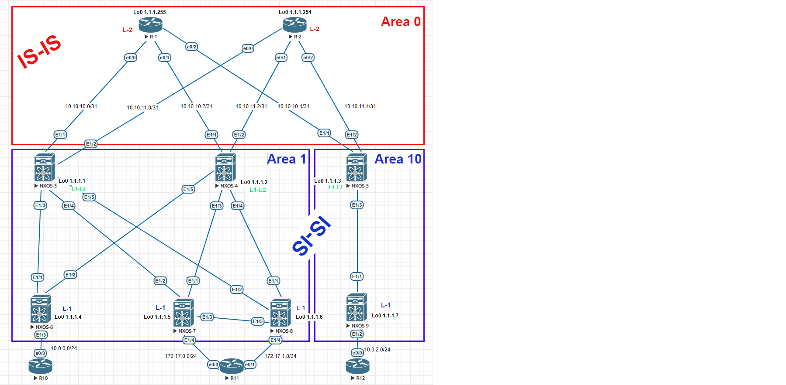

Цель: Настроить IS-IS для Underlay сети

1. Настроить IS-IS в Underlay сети, для IP связанности между всеми устройствами NXOS.
2. Проверка связности месжду сетями расположенных в одной локации, так и между локациями.
3. Предоставить вывод таблиц маршрутизации с утройств.

Пояснение. На схеме отражена распределенная сеть построенная на базе протокола IS-IS. Маршрутизаторы разбиты на три зоны. Зона Area 0 является связующей. Свзяь внутри зон Area 1 и Area 10 потроена на loopback адресах.

! В выводе убраны все настройки не относящиеся к поставленной задаче.

Настройка маршрутизаторов R-1 и R-2 Area 0:

R-1

<pre><code>

interface Loopback0
 ip address 1.1.1.255 255.255.255.255
 ip router isis 1
 isis circuit-type level-2-only
!
interface Ethernet0/0
 ip address 10.10.10.0 255.255.255.254
 ip router isis 1
 isis circuit-type level-2-only
 isis network point-to-point
!
interface Ethernet0/1
 ip address 10.10.10.2 255.255.255.254
 ip router isis 1
 isis circuit-type level-2-only
 isis network point-to-point
!
interface Ethernet0/2
 ip address 10.10.10.4 255.255.255.254
 ip router isis 1
 isis circuit-type level-2-only
 isis network point-to-point
!
interface Ethernet0/3
 no ip address
!
router isis 1
 net 49.0000.0000.0000.0255.00
 is-type level-2-only
 metric-style wide
 log-adjacency-changes
 maximum-paths 8

</code></pre>

R-2

<pre><code>

interface Loopback0
 ip address 1.1.1.254 255.255.255.255
 ip router isis 1
 isis circuit-type level-2-only
!
interface Ethernet0/0
 ip address 10.10.11.0 255.255.255.254
 ip router isis 1
 isis circuit-type level-2-only
 isis network point-to-point
!
interface Ethernet0/1
 ip address 10.10.11.2 255.255.255.254
 ip router isis 1
 isis circuit-type level-2-only
 isis network point-to-point
!
interface Ethernet0/2
 ip address 10.10.11.4 255.255.255.254
 ip router isis 1
 isis circuit-type level-2-only
 isis network point-to-point
!
interface Ethernet0/3
 no ip address
!
router isis 1
 net 49.0000.0000.0000.0254.00
 is-type level-2-only
 priority 127
 metric-style wide
 log-adjacency-changes
 maximum-paths 8

</code></pre>

Настройка маршрутизаторов NX-5 NX-9 Area 10:

NX-5

<pre><code>

feature isis

interface Ethernet1/1
  no switchport
  ip address 10.10.10.5/31
  isis network point-to-point
  isis circuit-type level-2
  ip router isis 1
  no shutdown

interface Ethernet1/2
  no switchport
  ip address 10.10.11.5/31
  isis network point-to-point
  isis circuit-type level-2
  ip router isis 1
  no shutdown

interface Ethernet1/3
  no switchport
  medium p2p
  ip unnumbered loopback0
  isis network point-to-point
  isis circuit-type level-1
  ip router isis 1
  no shutdown

  interface loopback0
    ip address 1.1.1.3/32
    ip router isis 1
  cli alias name wr copy running-config startup-config
  line console
  line vty
  no feature signature-verification
  router isis 1
    net 49.0010.0000.0000.0003.00
    distribute level-1 into level-2 all
    log-adjacency-changes

</code></pre>

NX-9

<pre><code>

feature isis

ip prefix-list redistribute_list seq 5 permit 10.0.2.0/24
route-map ISIS-redistribute permit 10
  match ip address prefix-list redistribute_list
vrf context management

interface Ethernet1/1
  no switchport
  medium p2p
  ip unnumbered loopback0
  isis network point-to-point
  isis circuit-type level-1
  ip router isis 1
  no shutdown

interface Ethernet1/2
  no switchport
  ip address 10.0.2.1/24
  no shutdown

  interface loopback0
    ip address 1.1.1.7/32
    isis circuit-type level-1
    ip router isis 1
  cli alias name wr copy running-config startup-config
  line console
  line vty
  no feature signature-verification
  router isis 1
    net 49.0010.0000.0000.0007.00
    is-type level-1
    redistribute direct route-map ISIS-redistribute
    log-adjacency-changes

</code></pre>

  Настройка маршрутизаторов NX-3 - 4 NX-6 - 8 Area 1:

NX-3

<pre><code>
feature isis

interface Ethernet1/1
  no switchport
  no ip redirects
  ip address 10.10.10.1/31
  no ipv6 redirects
  isis network point-to-point
  isis circuit-type level-2
  ip router isis 1
  no shutdown

interface Ethernet1/2
  no switchport
  no ip redirects
  ip address 10.10.11.1/31
  no ipv6 redirects
  isis network point-to-point
  isis circuit-type level-2
  ip router isis 1
  no shutdown

interface Ethernet1/3
  no switchport
  medium p2p
  no ip redirects
  ip unnumbered loopback0
  no ipv6 redirects
  isis network point-to-point
  isis circuit-type level-1
  ip router isis 1
  no shutdown

interface Ethernet1/4
  no switchport
  medium p2p
  no ip redirects
  ip unnumbered loopback0
  no ipv6 redirects
  isis network point-to-point
  isis circuit-type level-1
  ip router isis 1
  no shutdown

interface Ethernet1/5
  no switchport
  medium p2p
  no ip redirects
  ip unnumbered loopback0
  no ipv6 redirects
  isis network point-to-point
  isis circuit-type level-1
  ip router isis 1
  no shutdown

  interface loopback0
    ip address 1.1.1.1/32
    isis circuit-type level-2
    ip router isis 1
  cli alias name wr copy running-config startup-config
  line console
  line vty
  no feature signature-verification
  router isis 1
    net 49.0001.0000.0000.0001.00
    distribute level-1 into level-2 all
    log-adjacency-changes

</code></pre>

NX-4

<pre><code>
feature isis

interface Ethernet1/1
  no switchport
  ip address 10.10.10.3/31
  isis network point-to-point
  isis circuit-type level-2
  ip router isis 1
  no shutdown

interface Ethernet1/2
  no switchport
  ip address 10.10.11.3/31
  isis network point-to-point
  isis circuit-type level-2
  ip router isis 1
  no shutdown

interface Ethernet1/3
  no switchport
  medium p2p
  ip unnumbered loopback0
  isis network point-to-point
  isis circuit-type level-1
  ip router isis 1
  no shutdown

interface Ethernet1/4
  no switchport
  medium p2p
  ip unnumbered loopback0
  isis network point-to-point
  isis circuit-type level-1
  ip router isis 1
  no shutdown

interface Ethernet1/5
  no switchport
  medium p2p
  ip unnumbered loopback0
  isis network point-to-point
  isis circuit-type level-1
  ip router isis 1
  no shutdown

  interface loopback0
    ip address 1.1.1.2/32
    isis circuit-type level-2
    ip router isis 1
  cli alias name wr copy running-config startup-config
  line console
  line vty
  no feature signature-verification
  router isis 1
    net 49.0001.0000.0000.0002.00
    distribute level-1 into level-2 all
    log-adjacency-changes

</code></pre>

NX-6

<pre><code>
feature isis
ip prefix-list redistribute_list seq 5 permit 10.0.0.0/24
route-map ISIS-redistribute permit 10
  match ip address prefix-list redistribute_list
vrf context management

interface Ethernet1/1
  no switchport
  medium p2p
  ip unnumbered loopback0
  isis network point-to-point
  isis circuit-type level-1
  ip router isis 1
  no shutdown

interface Ethernet1/2
  no switchport
  medium p2p
  ip unnumbered loopback0
  isis network point-to-point
  isis circuit-type level-1
  ip router isis 1
  no shutdown

interface Ethernet1/3
  no switchport
  ip address 10.0.0.1/24
  no shutdown

  interface loopback0
    ip address 1.1.1.4/32
    isis circuit-type level-1
    ip router isis 1
  cli alias name wr copy running-config startup-config
  line console
  line vty
  no feature signature-verification
  router isis 1
    net 49.0001.0000.0000.0004.00
    is-type level-1
    redistribute direct route-map ISIS-redistribute
    log-adjacency-changes

</code></pre>

NX-7

<pre><code>
feature isis
ip prefix-list redistribute_list seq 5 permit 172.17.0.0/24
route-map ISIS-redistribute permit 10
  match ip address prefix-list redistribute_list
vrf context management

interface Ethernet1/1
  no switchport
  medium p2p
  ip unnumbered loopback0
  isis network point-to-point
  isis circuit-type level-1
  ip router isis 1
  no shutdown

interface Ethernet1/2
  no switchport
  medium p2p
  ip unnumbered loopback0
  isis network point-to-point
  isis circuit-type level-1
  ip router isis 1
  no shutdown

interface Ethernet1/3
  no switchport
  medium p2p
  ip unnumbered loopback0
  isis network point-to-point
  isis circuit-type level-1
  ip router isis 1
  no shutdown

interface Ethernet1/4
  no switchport
  ip address 172.17.0.1/24
  no shutdown

  interface loopback0
    ip address 1.1.1.5/32
    isis circuit-type level-1
    ip router isis 1
  cli alias name wr copy running-config startup-config
  line console
  line vty
  no feature signature-verification
  router isis 1
    net 49.0001.0000.0000.0005.00
    is-type level-1
    redistribute direct route-map ISIS-redistribute
    log-adjacency-changes

</code></pre>

NX-8

<pre><code>
feature isis

ip prefix-list redistribute_list seq 5 permit 172.17.1.0/24
route-map ISIS-redistribute permit 10
  match ip address prefix-list redistribute_list
vrf context management

interface Ethernet1/1
  no switchport
  medium p2p
  ip unnumbered loopback0
  isis network point-to-point
  isis circuit-type level-1
  ip router isis 1
  no shutdown

interface Ethernet1/2
  no switchport
  medium p2p
  ip unnumbered loopback0
  isis network point-to-point
  isis circuit-type level-1
  ip router isis 1
  no shutdown

interface Ethernet1/3
  no switchport
  medium p2p
  ip unnumbered loopback0
  isis network point-to-point
  isis circuit-type level-1
  ip router isis 1
  no shutdown

interface Ethernet1/4
  no switchport
  ip address 172.17.1.1/24
  no shutdown

  interface loopback0
    ip address 1.1.1.6/32
    isis circuit-type level-1
    ip router isis 1
  cli alias name wr copy running-config startup-config
  line console
  line vty
  no feature signature-verification
  router isis 1
    net 49.0001.0000.0000.0006.00
    is-type level-1
    redistribute direct route-map ISIS-redistribute
    log-adjacency-changes

</code></pre>

Маршрутные таблицы маршрутизаторов R-1 и R-2:

show ip route R-2

<pre><code>

1.0.0.0/32 is subnetted, 9 subnets
i L2     1.1.1.1 [115/11] via 10.10.11.1, 01:09:28, Ethernet0/0
i L2     1.1.1.2 [115/11] via 10.10.11.3, 01:09:28, Ethernet0/1
i L2     1.1.1.3 [115/11] via 10.10.11.5, 01:09:28, Ethernet0/2
i L2     1.1.1.4 [115/90] via 10.10.11.3, 01:09:28, Ethernet0/1
           [115/90] via 10.10.11.1, 01:09:28, Ethernet0/0
i L2     1.1.1.5 [115/51] via 10.10.11.3, 01:09:28, Ethernet0/1
           [115/51] via 10.10.11.1, 01:09:28, Ethernet0/0
i L2     1.1.1.6 [115/51] via 10.10.11.3, 01:09:28, Ethernet0/1
           [115/51] via 10.10.11.1, 01:09:28, Ethernet0/0
i L2     1.1.1.7 [115/51] via 10.10.11.5, 01:09:28, Ethernet0/2
C        1.1.1.254 is directly connected, Loopback0
i L2     1.1.1.255 [115/60] via 10.10.11.5, 01:09:28, Ethernet0/2
             [115/60] via 10.10.11.3, 01:09:28, Ethernet0/1
             [115/60] via 10.10.11.1, 01:09:28, Ethernet0/0
10.0.0.0/8 is variably subnetted, 11 subnets, 3 masks
i L2     10.0.0.0/24 [115/60] via 10.10.11.3, 01:09:28, Ethernet0/1
               [115/60] via 10.10.11.1, 01:09:28, Ethernet0/0
i L2     10.0.2.0/24 [115/60] via 10.10.11.5, 01:09:28, Ethernet0/2
i L2     10.10.10.0/31 [115/50] via 10.10.11.1, 01:09:28, Ethernet0/0
i L2     10.10.10.2/31 [115/50] via 10.10.11.3, 01:09:28, Ethernet0/1
i L2     10.10.10.4/31 [115/50] via 10.10.11.5, 01:09:28, Ethernet0/2
C        10.10.11.0/31 is directly connected, Ethernet0/0
L        10.10.11.0/32 is directly connected, Ethernet0/0
C        10.10.11.2/31 is directly connected, Ethernet0/1
L        10.10.11.2/32 is directly connected, Ethernet0/1
C        10.10.11.4/31 is directly connected, Ethernet0/2
L        10.10.11.4/32 is directly connected, Ethernet0/2
172.17.0.0/24 is subnetted, 2 subnets
i L2     172.17.0.0 [115/60] via 10.10.11.3, 01:09:28, Ethernet0/1
                    [115/60] via 10.10.11.1, 01:09:28, Ethernet0/0
i L2     172.17.1.0 [115/60] via 10.10.11.3, 01:09:28, Ethernet0/1
                    [115/60] via 10.10.11.1, 01:09:28, Ethernet0/0

</code></pre>

show ip route R-1

<pre><code>

1.0.0.0/32 is subnetted, 9 subnets
i L2     1.1.1.1 [115/11] via 10.10.10.1, 01:11:27, Ethernet0/0
i L2     1.1.1.2 [115/11] via 10.10.10.3, 01:11:27, Ethernet0/1
i L2     1.1.1.3 [115/11] via 10.10.10.5, 01:11:37, Ethernet0/2
i L2     1.1.1.4 [115/90] via 10.10.10.3, 01:11:27, Ethernet0/1
           [115/90] via 10.10.10.1, 01:11:27, Ethernet0/0
i L2     1.1.1.5 [115/51] via 10.10.10.3, 01:11:27, Ethernet0/1
           [115/51] via 10.10.10.1, 01:11:27, Ethernet0/0
i L2     1.1.1.6 [115/51] via 10.10.10.3, 01:11:27, Ethernet0/1
           [115/51] via 10.10.10.1, 01:11:27, Ethernet0/0
i L2     1.1.1.7 [115/51] via 10.10.10.5, 01:11:37, Ethernet0/2
i L2     1.1.1.254 [115/60] via 10.10.10.5, 01:11:07, Ethernet0/2
             [115/60] via 10.10.10.3, 01:11:07, Ethernet0/1
             [115/60] via 10.10.10.1, 01:11:07, Ethernet0/0
C        1.1.1.255 is directly connected, Loopback0
10.0.0.0/8 is variably subnetted, 11 subnets, 3 masks
i L2     10.0.0.0/24 [115/60] via 10.10.10.3, 01:11:27, Ethernet0/1
               [115/60] via 10.10.10.1, 01:11:27, Ethernet0/0
i L2     10.0.2.0/24 [115/60] via 10.10.10.5, 01:11:37, Ethernet0/2
C        10.10.10.0/31 is directly connected, Ethernet0/0
L        10.10.10.0/32 is directly connected, Ethernet0/0
C        10.10.10.2/31 is directly connected, Ethernet0/1
L        10.10.10.2/32 is directly connected, Ethernet0/1
C        10.10.10.4/31 is directly connected, Ethernet0/2
L        10.10.10.4/32 is directly connected, Ethernet0/2
i L2     10.10.11.0/31 [115/50] via 10.10.10.1, 01:11:27, Ethernet0/0
i L2     10.10.11.2/31 [115/50] via 10.10.10.3, 01:11:27, Ethernet0/1
i L2     10.10.11.4/31 [115/50] via 10.10.10.5, 01:11:37, Ethernet0/2
         172.17.0.0/24 is subnetted, 2 subnets
i L2     172.17.0.0 [115/60] via 10.10.10.3, 01:11:27, Ethernet0/1
                  [115/60] via 10.10.10.1, 01:11:27, Ethernet0/0
i L2     172.17.1.0 [115/60] via 10.10.10.3, 01:11:27, Ethernet0/1
                    [115/60] via 10.10.10.1, 01:11:27, Ethernet0/0

</code></pre>

show isis neighbors R-1

<pre><code>

Tag 1:
System Id      Type Interface   IP Address      State Holdtime Circuit Id
NXOS-3         L2   Et0/0       10.10.10.1      UP    27       01
NXOS-4         L2   Et0/1       10.10.10.3      UP    23       01
NX-5           L2   Et0/2       10.10.10.5      UP    21       01

</code></pre>

show isis neighbors R-2

<pre><code>

Tag 1:
System Id      Type Interface   IP Address      State Holdtime Circuit Id
NXOS-3         L2   Et0/0       10.10.11.1      UP    26       01
NXOS-4         L2   Et0/1       10.10.11.3      UP    26       01
NX-5           L2   Et0/2       10.10.11.5      UP    26       01

</code></pre>

Проверка доступности

Доступность с R-10

<pre><code>
R-10#show ip int bri
Interface                  IP-Address      OK? Method Status                Protocol
Ethernet0/0                10.0.0.2        YES manual up                    up
Ethernet0/1                unassigned      YES unset  administratively down down
Ethernet0/2                unassigned      YES unset  administratively down down
Ethernet0/3                unassigned      YES unset  administratively down down
R-10#ping 172.17.0.2 re 2
Type escape sequence to abort.
Sending 2, 100-byte ICMP Echos to 172.17.0.2, timeout is 2 seconds:
!!
Success rate is 100 percent (2/2), round-trip min/avg/max = 15/23/31 ms
R-10#
R-10#ping 172.17.1.2 re 2
Type escape sequence to abort.
Sending 2, 100-byte ICMP Echos to 172.17.1.2, timeout is 2 seconds:
!!
Success rate is 100 percent (2/2), round-trip min/avg/max = 13/16/20 ms
R-10#ping 10.0.2.2 re 2
Type escape sequence to abort.
Sending 2, 100-byte ICMP Echos to 10.0.2.2, timeout is 2 seconds:
!!
Success rate is 100 percent (2/2), round-trip min/avg/max = 20/24/28 ms
R-10#

R-10#traceroute 172.17.0.2
Type escape sequence to abort.
Tracing the route to
VRF info: (vrf in name/id, vrf out name/id)
  1 10.0.0.1 6 msec 5 msec 1 msec
  2 1.1.1.1 11 msec 11 msec
    1.1.1.2 17 msec
  3 1.1.1.5 33 msec 11 msec 17 msec
  4 172.17.0.2 25 msec 20 msec *

R-10#traceroute 10.0.2.2
Type escape sequence to abort.
Tracing the route to 10.0.2.2
VRF info: (vrf in name/id, vrf out name/id)
  1 10.0.0.1 6 msec 3 msec 2 msec
  2 1.1.1.1 6 msec 7 msec 9 msec
  3 10.10.11.0 11 msec 12 msec
    10.10.10.0 8 msec
  4 10.10.10.5 18 msec
    10.10.11.5 17 msec 15 msec

</code></pre>

